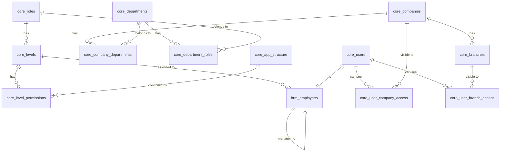

# PRD #00: โครงสร้างสิทธิ์และ DB Architecture (Foundation)

**Project:** SiamGroup V3.1
**Version:** 2.3
**วันที่:** 2026-03-04
**ผู้เขียน:** Product Manager (AI)
**สถานะ:** ✅ สมบูรณ์

> **เอกสารนี้เป็น Foundation Document** — PRD ทุกตัว (#01–#05) จะอ้างอิงโครงสร้างสิทธิ์จากเอกสารนี้

---

## 1. ภาพรวม (Overview)

ระบบ SiamGroup V3.1 ต้องรองรับโครงสร้างองค์กรที่ซับซ้อน:

### บริษัทในเครือ (4 บริษัท แบ่ง 2 ประเภท)

| ประเภท        | รหัส | ชื่อบริษัท                              | โครงสร้าง          |
| :------------ | :--- | :-------------------------------------- | :----------------- |
| **DHL**       | SXD  | บริษัท สยาม เอ็กซ์เพรส เดลิเวอรี่ จำกัด | คล้าย SXD ในผัง    |
| **DHL**       | SPD  | บริษัท สยาม พาร์เซล เดลิเวอรี่ จำกัด    | โครงสร้างคล้าย SXD |
| **CarRental** | SDR  | บริษัท สยามดอทเรนท์ จำกัด               | คล้าย SDR ในผัง    |
| **CarRental** | SAR  | บริษัท สยามออโต้เรนท์ จำกัด             | โครงสร้างคล้าย SDR |

> **กฎ:** บริษัทประเภทเดียวกันจะมีโครงสร้างคล้ายกัน (DHL คล้ายกัน, CarRental คล้ายกัน)

### สรุปโครงสร้าง

- **43 สาขา** (1 สาขา = 1 บริษัท)
- **แผนกซ้ำกันข้ามบริษัท** (เช่น HR, Sales, Operation, Accounting)
- **1 แผนกอยู่ได้หลายบริษัท** (Many-to-Many)
- **1 Role อยู่ได้หลายแผนก** (Many-to-Many)
- **Level ควบคุมการมองเห็น** (level_score น้อย = สูงกว่า = เห็นมากกว่า)
- **การอนุมัติใช้ manager_id** (ไม่ใช่ Level)
- **แผนก IT** สังกัด 1 บริษัท แต่เห็นข้อมูล **ทุกบริษัท**

---

## 2. ผังองค์กร (จากเอกสารอ้างอิง)

> **อ้างอิง:** `ref/Organizational_chart_of_the_company.png`

### SDR (บริษัทหลัก — ด้านซ้าย)

```
MD (ที่ปรึกษา)
├── Audit (ป้ามด)
├── Assist MD (อั้ม)
├── GM (เบนซ์)
├── เลขานุการ (พี่ยิ้ม)
├── Finance & Acc CFO (พี่ปอย)
│
├── [Management Level]
│   ├── Head of Sale & Marketing (อั้ม)
│   ├── HR (ป้ามด)
│   ├── Acc Manager (ป้าสมนึก)
│   ├── Finance Manager (พี่ปอย)
│   └── Head of IT (ป้ามด)
│
├── [Manager Level]
│   └── Sale Manager (จิรวรรธน์ วิจิตรจรรยา)
│
└── [Staffs Level]
    ├── Marketing Department
    │   ├── Creative (จุ๋ม)
    │   └── Copy Writer (Bot)
    ├── Sales Department
    │   ├── Admin (อารยา)
    │   ├── Admin (สุธิรัตน์)
    │   ├── Branch Manager(จิรวรรธน์)
    │   ├── Support Sale (หนิ่ง)
    │   └── Sales Executive ×6
    ├── Operation Department
    │   └── Data & Stock / Tracking / Bidding
    │       └── System Support (โอ๊ค)
    ├── Customer Service Department
    ├── HR Officer (พี่อิ๋ม)
    ├── Accounting Department
    │   ├── รับชำระเงิน (Billing) ×4
    │   └── แม่บ้าน (...)
    ├── Finance Department
    │   └── แอดมินกองทุน
    └── IT Department
        ├── Programmer (ป่าน:ฉันเอง)
        └── UX/UI
```

### SXD (บริษัทในเครือ — ด้านขวา)

```
MD (พี่ปอย)
├── GM (อ้อม)
├── Sale Director (พี่ริน)
├── Finance & Acc CFO (พี่ปอย)
├── Finance & Acc CFO (Mon)
│
├── [Management Level]
│   ├── HR Dept
│   ├── Operation Dept
│   └── Area Manager
│
└── [Staffs Level]
    ├── HR (พนังงาน Jr.)
    ├── Front Office
    ├── Packing
    ├── Courier
    ├── Telesale
    ├── Sale
    ├── Sales Dept
    │   └── ค่าบริการ, ค่าส่งนอก
    └── Accounting Dept
        └── ค่าบริการ, ค่าส่งนอก
```

### สิ่งที่เห็นจากผัง:

- **แผนกที่ซ้ำกัน** ระหว่าง SDR & SXD: HR, Sales, Operation, Accounting
- **3 ระดับ**: Management Level → Manager Level → Staffs
- **บริษัทแต่ละแห่งมีโครงสร้างต่างกัน** (SDR มี IT, Marketing — SXD ไม่มี)
- **แผนก IT เป็นทีมเดียว** ไม่สังกัดบริษัทไหน แต่ต้องเห็นข้อมูลทุก บ.
- **SPD** โครงสร้างคล้าย SXD, **SAR** โครงสร้างคล้าย SDR

### 2.1 แผนก (Departments) — 8 แผนก

| #   | ชื่อแผนก (TH)    | ชื่อแผนก (EN)    |    SDR/SAR     |    SXD/SPD     | หมายเหตุ                           |
| :-- | :--------------- | :--------------- | :------------: | :------------: | :--------------------------------- |
| 1   | ฝ่ายบริหาร       | Executive        |       ✅       |       ✅       | MD, GM, CFO, Asst MD               |
| 2   | ฝ่ายขาย          | Sales            |       ✅       |       ✅       | รวม Telesale                       |
| 3   | ปฏิบัติการ       | Operation        |       ✅       |       ✅       | รวม Front Office, Packing, Courier |
| 4   | บัญชีและการเงิน  | Acc & Finance    |       ✅       |       ✅       | รวม Accounting + Finance           |
| 5   | ทรัพยากรบุคคล    | HR               |       ✅       |       ✅       |                                    |
| 6   | การตลาด          | Marketing        |       ✅       |       ❌       | รวมกราฟฟิค, Creative, Copy Writer  |
| 7   | ฝ่ายบริการลูกค้า | Customer Service |       ✅       |       ❌       |                                    |
| 8   | IT               | IT               | ❌ ไม่สังกัดบ. | ❌ ไม่สังกัดบ. | เห็นทุกบ. ผ่าน `is_cross_company`  |

> **หมายเหตุ IT:** แผนก IT ไม่ผูกกับบริษัทใดใน `core_company_departments` — ใช้ `is_cross_company` flag สำหรับเห็นข้อมูลทุกบริษัท

### 2.2 ตำแหน่ง (Roles) — 6 กลุ่ม

> **หลักการ:** Role ใช้เป็น **กลุ่มระดับ** กว้างๆ → ส่วนชื่อตำแหน่งจริง (เช่น MD, Programmer) เก็บใน `core_levels.name`

| #   | Role (TH)     | Role (EN)       | Level Score | ตัวอย่างตำแหน่งจริง (core_levels.name)                           |
| :-- | :------------ | :-------------- | :---------: | :--------------------------------------------------------------- |
| 1   | ผู้บริหาร     | Executive       |      1      | MD, CFO                                                          |
| 2   | รองผู้บริหาร  | Asst. Executive |      2      | Asst MD, GM                                                      |
| 3   | ผู้จัดการ     | Manager         |     3–4     | Sale Director, Head of IT, HR Manager, Acc Manager, Area Manager |
| 4   | หัวหน้างาน    | Supervisor      |      5      | Branch Manager, Sale Manager                                     |
| 5   | พนักงาน       | Staff           |      7      | Programmer, Sales Executive, HR Officer, Courier                 |
| 6   | พนักงานทั่วไป | General         |      8      | Jr. Staff                                                        |

> **Level 6 (Senior Staff)** สำรองไว้สำหรับอนาคต — ยังไม่มีคนใช้

### 2.3 ตัวอย่างข้อมูล `core_levels` (ชื่อตำแหน่งจริง)

| level_id | role (กลุ่ม)  | level_score | name (ตำแหน่งจริง) |
| :------- | :------------ | :---------: | :----------------- |
| 1        | ผู้บริหาร     |      1      | MD                 |
| 2        | ผู้บริหาร     |      1      | CFO                |
| 3        | รองผู้บริหาร  |      2      | Asst MD            |
| 4        | รองผู้บริหาร  |      2      | GM                 |
| 5        | ผู้จัดการ     |      3      | Sale Director      |
| 6        | ผู้จัดการ     |      3      | Head of IT         |
| 7        | ผู้จัดการ     |      4      | HR Manager         |
| 8        | ผู้จัดการ     |      4      | Acc Manager        |
| 9        | ผู้จัดการ     |      4      | Area Manager       |
| 10       | หัวหน้างาน    |      5      | Branch Manager     |
| 11       | หัวหน้างาน    |      5      | Sale Manager       |
| 12       | พนักงาน       |      7      | Programmer         |
| 13       | พนักงาน       |      7      | Sales Executive    |
| 14       | พนักงาน       |      7      | HR Officer         |
| 15       | พนักงาน       |      7      | Courier            |
| 16       | พนักงาน       |      7      | พนักงานบัญชี       |
| 17       | พนักงานทั่วไป |      8      | Jr. Staff          |

---

## 3. DB Schema เดิม (ปัจจุบัน — ต้องปรับ)

```
core_companies    ← 4 บริษัท
    │
    └── core_branches (company_id ← 1:N)    ← 43 สาขา
    │
    └── core_departments (company_id ← 1:1 ❌ ต้องปรับ)
            │
            └── core_levels (department_id + role_id)
                    │
                    └── core_level_permissions (level_id + app_structure_id)

core_roles (standalone — ไม่มี FK กับ department/company)
```

### ปัญหาของ Schema เดิม:

| ปัญหา                               | รายละเอียด                                               |
| :---------------------------------- | :------------------------------------------------------- |
| `core_departments.company_id` = 1:1 | ❌ 1 แผนก ผูกได้แค่ 1 บริษัท — แต่ HR อยู่ทั้ง SDR + SXD |
| Role ไม่ผูกกับ Department           | ❌ ไม่สามารถกำหนดว่า Role ไหนอยู่แผนกไหน                 |
| Level อยู่ใน 1 Department + 1 Role  | ❌ ถ้า Role เดียวกันอยู่หลายแผนก ต้องสร้าง Level ซ้ำ     |

---

## 4. DB Schema ใหม่ (Proposed — Many-to-Many)

### 4.1 ER Diagram (Mermaid)



### 4.2 ตารางที่ต้อง **เพิ่มใหม่**

#### 🆕 `core_company_departments` (Junction: บริษัท ↔ แผนก)

| Column          | Type                 | คำอธิบาย                   |
| :-------------- | :------------------- | :------------------------- |
| `id`            | INT AUTO_INCREMENT   | PK                         |
| `company_id`    | INT                  | FK → `core_companies.id`   |
| `department_id` | INT                  | FK → `core_departments.id` |
| `is_active`     | TINYINT(1) DEFAULT 1 |                            |
| `created_at`    | TIMESTAMP            |                            |

> **UNIQUE KEY:** (`company_id`, `department_id`) — ป้องกันซ้ำ

**ตัวอย่างข้อมูล:**

| company_id | department_id | หมายถึง                                  |
| :--------- | :------------ | :--------------------------------------- |
| 1 (SDR)    | 1 (HR)        | SDR มีแผนก HR                            |
| 2 (SXD)    | 1 (HR)        | SXD มีแผนก HR เหมือนกัน                  |
| 3 (SPD)    | 1 (HR)        | SPD มีแผนก HR เหมือนกัน                  |
| 4 (SAR)    | 1 (HR)        | SAR มีแผนก HR เหมือนกัน                  |
| 1 (SDR)    | 5 (IT)        | SDR มีแผนก IT (สังกัด SDR แต่เห็นทุก บ.) |

> **กรณีพิเศษ IT:** แผนก IT สังกัดแค่ SDR แต่ใน `core_level_permissions` จะให้สิทธิ์เห็นข้อมูลทุกบริษัท (ผ่าน Level ที่มี `is_cross_company = true`)

---

#### 🆕 `core_department_roles` (Junction: แผนก ↔ Role)

| Column          | Type                 | คำอธิบาย                   |
| :-------------- | :------------------- | :------------------------- |
| `id`            | INT AUTO_INCREMENT   | PK                         |
| `department_id` | INT                  | FK → `core_departments.id` |
| `role_id`       | INT                  | FK → `core_roles.id`       |
| `is_active`     | TINYINT(1) DEFAULT 1 |                            |
| `created_at`    | TIMESTAMP            |                            |

> **UNIQUE KEY:** (`department_id`, `role_id`) — ป้องกันซ้ำ

**ตัวอย่างข้อมูล:**

| department_id | role_id            | หมายถึง                            |
| :------------ | :----------------- | :--------------------------------- |
| 2 (Sales)     | 3 (Sale Executive) | แผนก Sales มี Role: Sale Executive |
| 2 (Sales)     | 4 (Branch Manager) | แผนก Sales มี Role: Branch Manager |
| 4 (Operation) | 6 (Courier)        | แผนก Operation มี Role: Courier    |
| 4 (Operation) | 7 (Packing)        | แผนก Operation มี Role: Packing    |

---

#### 🆕 `core_user_company_access` (Junction: ผู้ใช้ ↔ บริษัทที่เห็น)

| Column       | Type                 | คำอธิบาย                 |
| :----------- | :------------------- | :----------------------- |
| `id`         | INT AUTO_INCREMENT   | PK                       |
| `user_id`    | BIGINT UNSIGNED      | FK → `core_users.id`     |
| `company_id` | INT                  | FK → `core_companies.id` |
| `is_active`  | TINYINT(1) DEFAULT 1 |                          |
| `created_at` | TIMESTAMP            |                          |
| `created_by` | BIGINT DEFAULT NULL  | ผู้ที่ทำการตั้งค่า       |

> **UNIQUE KEY:** (`user_id`, `company_id`) — ป้องกันซ้ำ
> **สิทธิ์การจัดการ:** เฉพาะ `core_users.is_admin = 1` เท่านั้น

**ตัวอย่างข้อมูล:**

| user_id    | company_id | หมายถึง                                          |
| :--------- | :--------- | :----------------------------------------------- |
| 5 (พี่ปอย) | 1 (SDR)    | พี่ปอยเห็นข้อมูล SDR                             |
| 5 (พี่ปอย) | 2 (SXD)    | พี่ปอยเห็นข้อมูล SXD ด้วย (เห็น 2 บ.)            |
| 5 (พี่ปอย) | 3 (SPD)    | พี่ปอยเห็นข้อมูล SPD ด้วย (เห็น 3 บ.)            |
| 5 (พี่ปอย) | 4 (SAR)    | พี่ปอยเห็นข้อมูล SAR ด้วย (เห็นทั้ง 4 บ.)        |
| 20 (หนิ่ง) | 1 (SDR)    | หนิ่งเห็นแค่ SDR (เห็น 1 บ. → เห็นแค่สาขาตัวเอง) |

---

#### 🆕 `core_user_branch_access` (Override: สาขาที่เห็น)

| Column       | Type                 | คำอธิบาย                |
| :----------- | :------------------- | :---------------------- |
| `id`         | INT AUTO_INCREMENT   | PK                      |
| `user_id`    | BIGINT UNSIGNED      | FK → `core_users.id`    |
| `branch_id`  | INT UNSIGNED         | FK → `core_branches.id` |
| `is_active`  | TINYINT(1) DEFAULT 1 |                         |
| `created_at` | TIMESTAMP            |                         |
| `created_by` | BIGINT DEFAULT NULL  | ผู้ที่ทำการตั้งค่า      |

> **UNIQUE KEY:** (`user_id`, `branch_id`) — ป้องกันซ้ำ
> **สิทธิ์การจัดการ:** เฉพาะ `core_users.is_admin = 1` เท่านั้น
> **ตารางนี้ใช้ override default เท่านั้น** — ดูกฎ Default ที่ Section 5.6

**ตัวอย่างข้อมูล:**

| user_id    | branch_id        | หมายถึง                                                                           |
| :--------- | :--------------- | :-------------------------------------------------------------------------------- |
| 20 (หนิ่ง) | 5 (สาขาลาดพร้าว) | หนิ่งเห็น 1 บ. → default เห็นแค่สาขาตัวเอง แต่ Admin เพิ่มสาขาลาดพร้าวให้เห็นด้วย |
| 5 (พี่ปอย) | _(ไม่มีข้อมูล)_  | พี่ปอยเห็นหลายบ. → default เห็นทุกสาขา (ไม่ต้อง override)                         |

---

### 4.3 ตารางที่ต้อง **แก้ไข**

#### ✏️ `core_departments` — ลบ `company_id` ออก

**เดิม:**

```sql
CREATE TABLE core_departments (
    id INT AUTO_INCREMENT,
    company_id INT NULL,          -- ❌ ลบออก
    name VARCHAR(100) NOT NULL,
    ...
);
```

**ใหม่:**

```sql
CREATE TABLE core_departments (
    id INT AUTO_INCREMENT,
    -- ❌ ไม่มี company_id แล้ว — ใช้ core_company_departments แทน
    name VARCHAR(100) NOT NULL,
    name_en VARCHAR(100) DEFAULT NULL,
    is_active TINYINT(1) DEFAULT 1,
    created_at TIMESTAMP DEFAULT CURRENT_TIMESTAMP,
    updated_at TIMESTAMP DEFAULT CURRENT_TIMESTAMP ON UPDATE CURRENT_TIMESTAMP,
    PRIMARY KEY (id)
);
```

#### ✏️ `core_levels` — ลบ `department_id` ออก ✅ (ยืนยันแล้ว)

**เดิม:**

```sql
CREATE TABLE core_levels (
    id INT AUTO_INCREMENT,
    role_id INT NOT NULL,
    department_id INT DEFAULT NULL,  -- ❌ ลบออก
    level_score INT DEFAULT 10,      -- 1=สูงสุด, 10=ต่ำสุด
    ...
);
```

**ใหม่:**

```sql
CREATE TABLE core_levels (
    id INT AUTO_INCREMENT,
    role_id INT NOT NULL,
    -- department_id ย้ายไป core_department_roles แล้ว
    level_score INT DEFAULT 10,      -- 1=สูงสุด, 10=ต่ำสุด
    name VARCHAR(100) DEFAULT NULL,  -- 🆕 ชื่อ Level เช่น "ผู้จัดการ", "พนักงาน"
    description VARCHAR(255) DEFAULT NULL,
    created_at TIMESTAMP DEFAULT CURRENT_TIMESTAMP,
    updated_at TIMESTAMP DEFAULT CURRENT_TIMESTAMP ON UPDATE CURRENT_TIMESTAMP,
    PRIMARY KEY (id),
    FOREIGN KEY (role_id) REFERENCES core_roles(id)
);
```

---

## 5. ระบบ Level — การมองเห็นข้อมูล

### 5.1 หลักการ

> **Level ควบคุมการ "มองเห็น" เท่านั้น** — ไม่ใช่การอนุมัติ (อนุมัติใช้ `manager_id`)

- `level_score` น้อย = สูงกว่า = **เห็นข้อมูลของ level_score ที่มากกว่าทั้งหมด**
- ตัวอย่าง: Level 1 (MD) เห็นทุกอย่าง, Level 5 (Manager) เห็น Level 6-10

### 5.2 ตาราง Level Score

| level_score | ระดับ        | Role (กลุ่ม)  | ตัวอย่าง `core_levels.name`                 | เห็นข้อมูลของ           |
| :---------- | :----------- | :------------ | :------------------------------------------ | :---------------------- |
| 1           | สูงสุด       | ผู้บริหาร     | MD, CFO                                     | ทุกคน ทุกแผนก ทุกบริษัท |
| 2           | ผู้บริหาร    | รองผู้บริหาร  | Asst MD, GM                                 | Level 3–8               |
| 3           | Director     | ผู้จัดการ     | Sale Director, Head of IT                   | Level 4–8               |
| 4           | Manager      | ผู้จัดการ     | HR Manager, Acc Manager, Area Manager       | Level 5–8               |
| 5           | Supervisor   | หัวหน้างาน    | Branch Manager, Sale Manager                | Level 6–8               |
| 6           | Senior Staff | _(สำรอง)_     | _(ยังไม่ใช้)_                               | Level 7–8               |
| 7           | Staff        | พนักงาน       | Programmer, Sales Exec, HR Officer, Courier | ตัวเองเท่านั้น          |
| 8           | Junior       | พนักงานทั่วไป | Jr. Staff                                   | ตัวเองเท่านั้น          |

### 5.3 Logic การกรองข้อมูล

```
ผู้ใช้ Login → ดึง level_score จาก core_levels

Query ข้อมูล:
  WHERE target_employee.level_score >= current_user.level_score
  AND target_employee อยู่ในแผนก/บริษัทเดียวกัน (ถ้า Role ผูกหลาย บ. → เห็นทั้ง 2 บ.)
```

### 5.4 สิทธิ์การเห็นบริษัท (Company Visibility)

> **แต่ละคนสามารถถูกกำหนดให้เห็นบริษัทไหนบ้าง — เพิ่ม/ลดได้โดย Admin**

#### ลำดับการดึงบริษัทที่เห็น:

1. **ถ้ามี record ใน `core_user_company_access`** → ใช้บริษัทจากตารางนี้ (Admin กำหนดเฉพาะบุคคล)
2. **ถ้าไม่มี record ใน `core_user_company_access`** → Fallback ดูจาก `core_company_departments` (ดึงบริษัทที่แผนกของ user สังกัดอยู่)

#### รายละเอียด:

- **Override (ทางตรง):** `core_user_company_access` — Admin (`core_users.is_admin = 1`) กำหนดเฉพาะบุคคล
- **Default (Fallback):** `core_company_departments` — ดูจากแผนกของ user (ผ่าน `hrm_employees.level_id` → `core_levels.role_id` → `core_department_roles` → `core_company_departments`)
- ตัวอย่าง: พี่ปอย (CFO) อาจได้รับ assign ใน `core_user_company_access` ให้เห็นทั้ง SDR + SXD + SPD + SAR
- ตัวอย่าง: Sale Executive ไม่มี record → fallback จากแผนก Sales ที่สังกัด SDR → เห็นแค่ SDR (1 บ.)

### 5.5 สิทธิ์การเห็นสาขา (Branch Visibility)

> **สาขาที่เห็นขึ้นอยู่กับจำนวนบริษัทที่ถูก assign — แต่ Admin สามารถ override ได้**

#### กฎ Default:

| จำนวน บ. ที่เห็น | Default สาขา                                       | Override ได้ไหม                       |
| :--------------- | :------------------------------------------------- | :------------------------------------ |
| **1 บ.**         | เห็น **แค่สาขาตัวเอง** (`hrm_employees.branch_id`) | ✅ Admin เพิ่มสาขาอื่นในบ.เดียวกันได้ |
| **มากกว่า 1 บ.** | เห็น **ทุกสาขา** ของทุกบ.ที่ assign                | ✅ Admin ลดสาขาที่เห็นได้             |

#### Override ผ่าน `core_user_branch_access`:

- **กรณี 1 บ. — เพิ่มสาขา:** Admin เพิ่ม record ใน `core_user_branch_access` → user เห็นสาขาตัวเอง + สาขาที่เพิ่ม
- **กรณีหลาย บ. — ลดสาขา:** ถ้ามี record ใน `core_user_branch_access` → ใช้เฉพาะสาขาที่ระบุแทน default ทั้งหมด

#### Logic การดึงบริษัท + สาขาที่เห็น (Pseudocode):

```
ผู้ใช้ Login

— ขั้นตอนที่ 1: ดึง บ. ที่เห็น —
ถ้า มี record ใน core_user_company_access:
  → ใช้บริษัทจาก core_user_company_access
ถ้า ไม่มี record:
  → Fallback: ดึงบริษัทจาก core_company_departments (ตามแผนกของ user)

→ นับจำนวน บ. ที่ได้

— ขั้นตอนที่ 2: ดึงสาขาที่เห็น —
ถ้า มี override ใน core_user_branch_access:
  → ใช้สาขาจาก core_user_branch_access (กรณี 1 บ. = เพิ่ม, กรณีหลาย บ. = จำกัด)

ถ้า ไม่มี override:
  ถ้า จำนวน บ. = 1:
    → เห็นแค่ hrm_employees.branch_id (สาขาตัวเอง)
  ถ้า จำนวน บ. > 1:
    → เห็นทุกสาขาของทุก บ. ที่ assign
```

### 5.6 กรณีพิเศษ: แผนก IT

> **IT สังกัด 1 บริษัท (SDR) แต่ต้องเห็นข้อมูลทุกบริษัท**

- ใน `core_company_departments` → IT ผูกแค่ SDR
- แต่ใน `core_levels` + `core_level_permissions` → ให้สิทธิ์เห็นข้อมูลข้ามบริษัท (flag `is_cross_company`)
- ยังคงใช้กฎเดิมตาม PRD — ไม่เปลี่ยนแปลง

---

## 6. ระบบอนุมัติ (Approval Chain)

### 6.1 หลักการ

> **การอนุมัติใช้ `manager_id` — ไม่ใช่ Level**

```
พนักงาน  →  หัวหน้าโดยตรง (manager_id)
              →  หัวหน้าของหัวหน้า (manager ของ manager)
```

### 6.2 ที่เก็บข้อมูล

- `hrm_employees.manager_id` → FK ไปที่ `hrm_employees.id`
- เป็น **self-referencing FK** — Recursive
- MD จะมี `manager_id = NULL` (ไม่มีหัวหน้า)

---

## 7. ระบบสิทธิ์ Action-Based Permission

> **หลักการ:** ทุกปุ่ม/Action ในระบบถูกเก็บเป็น Master Data → กำหนดสิทธิ์ได้ต่อ Level (Default) + Override ต่อ User → **มีสิทธิ์ = เห็นปุ่ม / ไม่มี = ไม่เห็น**

### 7.1 โครงสร้าง 2 ชั้น: Page + Action (แยกตาราง)

| ชั้น                 | ตาราง                 | คำอธิบาย                         |
| :------------------- | :-------------------- | :------------------------------- |
| **Page** (หน้า/เมนู) | `core_app_structure`  | เก็บหน้า/เมนูในระบบ (มีอยู่แล้ว) |
| **Action** (ปุ่ม)    | `core_app_actions` 🆕 | เก็บปุ่ม/Action ภายในแต่ละหน้า   |

### 7.2 สิทธิ์ 2 ระดับ: Level Default + User Override

| ระดับ                          | Page (หน้า)                           | Action (ปุ่ม)                      |
| :----------------------------- | :------------------------------------ | :--------------------------------- |
| **Level Default** (ตามตำแหน่ง) | `core_level_permissions` (มีอยู่แล้ว) | `core_level_action_permissions` 🆕 |
| **User Override** (ต่อบุคคล)   | `core_user_permissions` 🆕            | `core_user_action_permissions` 🆕  |

> **Level Default:** มี record = เห็น / ไม่มี = ไม่เห็น
> **User Override:** `is_granted = 1` เพิ่มสิทธิ์ / `is_granted = 0` ลดสิทธิ์

### 7.3 DB Schema ใหม่

#### 🆕 `core_app_actions` (ปุ่ม/Action ภายในหน้า)

```sql
CREATE TABLE `core_app_actions` (
    `id` INT AUTO_INCREMENT PRIMARY KEY,
    `page_id` INT NOT NULL COMMENT 'FK → core_app_structure.id',
    `code` VARCHAR(100) NOT NULL UNIQUE COMMENT 'รหัส e.g. doc_cert_work_request',
    `name_th` VARCHAR(200) NOT NULL COMMENT 'ชื่อปุ่ม (TH)',
    `name_en` VARCHAR(200) NULL COMMENT 'ชื่อปุ่ม (EN)',
    `description` VARCHAR(500) NULL,
    `sort_order` INT DEFAULT 0,
    `is_active` TINYINT(1) DEFAULT 1,
    `created_at` TIMESTAMP DEFAULT CURRENT_TIMESTAMP,
    `updated_at` TIMESTAMP DEFAULT CURRENT_TIMESTAMP ON UPDATE CURRENT_TIMESTAMP,
    CONSTRAINT `fk_action_page` FOREIGN KEY (`page_id`) REFERENCES `core_app_structure` (`id`)
) COMMENT = 'ปุ่ม/Action ภายในแต่ละหน้า';
```

#### 🆕 `core_level_action_permissions` (สิทธิ์ Level ต่อ Action)

```sql
CREATE TABLE `core_level_action_permissions` (
    `id` INT AUTO_INCREMENT PRIMARY KEY,
    `level_id` INT NOT NULL COMMENT 'FK → core_levels.id',
    `action_id` INT NOT NULL COMMENT 'FK → core_app_actions.id',
    `created_at` TIMESTAMP DEFAULT CURRENT_TIMESTAMP,
    UNIQUE KEY `idx_level_action` (`level_id`, `action_id`),
    CONSTRAINT `fk_lap_level` FOREIGN KEY (`level_id`) REFERENCES `core_levels` (`id`),
    CONSTRAINT `fk_lap_action` FOREIGN KEY (`action_id`) REFERENCES `core_app_actions` (`id`)
) COMMENT = 'สิทธิ์ Level ต่อ Action (มี record = เห็น)';
```

#### 🆕 `core_user_permissions` (Override User ต่อ Page)

```sql
CREATE TABLE `core_user_permissions` (
    `id` INT AUTO_INCREMENT PRIMARY KEY,
    `user_id` BIGINT UNSIGNED NOT NULL COMMENT 'FK → core_users.id',
    `app_structure_id` INT NOT NULL COMMENT 'FK → core_app_structure.id',
    `is_granted` TINYINT(1) NOT NULL DEFAULT 1 COMMENT '1=เพิ่มสิทธิ์, 0=ลดสิทธิ์',
    `created_by` BIGINT UNSIGNED NULL COMMENT 'Admin ผู้ตั้งค่า',
    `created_at` TIMESTAMP DEFAULT CURRENT_TIMESTAMP,
    `updated_at` TIMESTAMP DEFAULT CURRENT_TIMESTAMP ON UPDATE CURRENT_TIMESTAMP,
    UNIQUE KEY `idx_user_page` (`user_id`, `app_structure_id`),
    CONSTRAINT `fk_up_user` FOREIGN KEY (`user_id`) REFERENCES `core_users` (`id`),
    CONSTRAINT `fk_up_page` FOREIGN KEY (`app_structure_id`) REFERENCES `core_app_structure` (`id`)
) COMMENT = 'Override สิทธิ์ User ต่อ Page';
```

#### 🆕 `core_user_action_permissions` (Override User ต่อ Action)

```sql
CREATE TABLE `core_user_action_permissions` (
    `id` INT AUTO_INCREMENT PRIMARY KEY,
    `user_id` BIGINT UNSIGNED NOT NULL COMMENT 'FK → core_users.id',
    `action_id` INT NOT NULL COMMENT 'FK → core_app_actions.id',
    `is_granted` TINYINT(1) NOT NULL DEFAULT 1 COMMENT '1=เพิ่มสิทธิ์, 0=ลดสิทธิ์',
    `created_by` BIGINT UNSIGNED NULL COMMENT 'Admin ผู้ตั้งค่า',
    `created_at` TIMESTAMP DEFAULT CURRENT_TIMESTAMP,
    `updated_at` TIMESTAMP DEFAULT CURRENT_TIMESTAMP ON UPDATE CURRENT_TIMESTAMP,
    UNIQUE KEY `idx_user_action` (`user_id`, `action_id`),
    CONSTRAINT `fk_uap_user` FOREIGN KEY (`user_id`) REFERENCES `core_users` (`id`),
    CONSTRAINT `fk_uap_action` FOREIGN KEY (`action_id`) REFERENCES `core_app_actions` (`id`)
) COMMENT = 'Override สิทธิ์ User ต่อ Action';
```

### 7.4 Logic ตรวจสอบสิทธิ์

```
ผู้ใช้เข้าระบบ → ดึง level_id จาก core_levels

═══ ตรวจสอบ Page (หน้า) ═══
1. ดู core_user_permissions (user_id + app_structure_id)
   → มี record: is_granted=1 → ✅ เห็น / is_granted=0 → ❌ ไม่เห็น
2. ไม่มี → ดู core_level_permissions (level_id + app_structure_id)
   → มี record → ✅ เห็น
3. ไม่มี record ทั้ง 2 → ❌ ไม่เห็น

═══ ตรวจสอบ Action (ปุ่ม) ═══
1. ดู core_user_action_permissions (user_id + action_id)
   → มี record: is_granted=1 → ✅ เห็น / is_granted=0 → ❌ ไม่เห็น
2. ไม่มี → ดู core_level_action_permissions (level_id + action_id)
   → มี record → ✅ เห็น
3. ไม่มี record ทั้ง 2 → ❌ ไม่เห็น
```

### 7.5 ตัวอย่าง: สิทธิ์เอกสาร (จาก PRD #03 Section 11)

| Action (ปุ่ม)                 | HR Manager | Staff | ผู้บริหาร |
| :---------------------------- | :--------: | :---: | :-------: |
| ร้องขอ หนังสือรับรองการทำงาน  |     ✅     |  ✅   |    ✅     |
| ร้องขอ หนังสือรับรองเงินเดือน |     ✅     |  ✅   |    ✅     |
| ยืนยัน หนังสือรับรอง          |     ✅     |  ❌   |    ❌     |
| ร้องขอ สัญญาจ้าง              |     ✅     |  ❌   |    ❌     |
| ยืนยัน สัญญาจ้าง              |     ❌     |  ❌   |    ✅     |
| ร้องขอ ใบลาออก                |     ✅     |  ✅   |    ✅     |
| ยืนยัน ใบลาออก                |     ✅     |  ❌   |    ❌     |
| ร้องขอ หนังสือแจ้งโทษ         |     ✅     |  ❌   |    ❌     |
| ยืนยัน หนังสือแจ้งโทษ         |     ❌     |  ❌   |    ✅     |
| ดาวน์โหลดเอกสาร               |     ✅     | ✅\*  |    ✅     |

> \* Staff ดาวน์โหลดได้เฉพาะเอกสารของตัวเอง → ควบคุมโดย Backend Query (ไม่ใช่ระบบสิทธิ์ปุ่ม)
> **ยืดหยุ่น:** Admin เปลี่ยนได้ตลอดเวลา ไม่ Hardcode

---

## 8. สรุปการเปลี่ยนแปลง DB

### ตารางใหม่ที่ต้องสร้าง:

| #   | ตาราง                           | ประเภท   | ทำไม                                    |
| :-- | :------------------------------ | :------- | :-------------------------------------- |
| 1   | `core_company_departments`      | Junction | บริษัท ↔ แผนก (M:N)                     |
| 2   | `core_department_roles`         | Junction | แผนก ↔ Role (M:N)                       |
| 3   | `core_user_company_access`      | Junction | ผู้ใช้ ↔ บริษัทที่เห็น (กำหนดโดย Admin) |
| 4   | `core_user_branch_access`       | Override | Override สาขาที่เห็น (กำหนดโดย Admin)   |
| 5   | `core_app_actions`              | Master   | ปุ่ม/Action ภายในหน้า                   |
| 6   | `core_level_action_permissions` | Junction | สิทธิ์ Level ต่อ Action (Default)       |
| 7   | `core_user_permissions`         | Override | Override สิทธิ์ User ต่อ Page           |
| 8   | `core_user_action_permissions`  | Override | Override สิทธิ์ User ต่อ Action         |

### ตารางที่ต้องแก้ไข:

| #   | ตาราง              | แก้ไขอะไร                                |
| :-- | :----------------- | :--------------------------------------- |
| 1   | `core_departments` | ลบ `company_id` ออก                      |
| 2   | `core_levels`      | ลบ `department_id` ออก (ย้ายไป junction) |

### ตารางที่ไม่เปลี่ยน:

| #   | ตาราง                    | หมายเหตุ                                      |
| :-- | :----------------------- | :-------------------------------------------- |
| 1   | `core_companies`         | เพิ่ม `company_type` (`DHL` / `CAR_RENTAL`)   |
| 2   | `core_branches`          | ไม่เปลี่ยน (ยังผูก 1 บริษัท)                  |
| 3   | `core_roles`             | ไม่เปลี่ยน                                    |
| 4   | `core_level_permissions` | ไม่เปลี่ยน (ยังผูกกับ levels + app_structure) |
| 5   | `hrm_employees`          | ไม่เปลี่ยน (ยังผูก level_id + manager_id)     |

---

## 9. Relationship Diagram สรุป

```
core_companies ──M:N──> core_company_departments <──M:N── core_departments
       │                                                        │
       │                                                        M:N
       │                                                        │
       │                                                 core_department_roles
       │                                                        │
       │                                                        M:N
       │                                                        │
       │                                                    core_roles
       │                                                        │
       │                                                        1:N
       │                                                        │
       │                                                    core_levels
       │                                                      │      │
       │                                                     1:N    1:N
       │                                                      │      │
       │                                        core_level_permissions    hrm_employees
       │                                                                        │
       │                                                                    (manager_id → self)
       │                                                                        │
       │                                                                    core_users
       │                                                                     │     │
       └──────── core_user_company_access ──────────────────────────────────────┘     │
                                                                                     │
core_branches ── core_user_branch_access ────────────────────────────────────────────┘

การอนุมัติ: hrm_employees.manager_id → hrm_employees.id (Recursive Chain)
การมองเห็น: core_levels.level_score (น้อย = สูงกว่า = เห็นมากกว่า)
การเห็นบริษัท: core_user_company_access (กำหนดโดย Admin)
การเห็นสาขา: Default ตามจำนวน บ. + Override ผ่าน core_user_branch_access
```

---

## 10. ข้อกำหนดทางเทคนิค

| หัวข้อ                     | รายละเอียด                                   |
| :------------------------- | :------------------------------------------- |
| **Database**               | MySQL (PDO Prepared Statements)              |
| **Migration**              | ต้องทำ Migration Script สำหรับย้ายข้อมูลเดิม |
| **Backward Compatibility** | ต้องไม่ทำให้ระบบเดิมเสีย                     |
| **Phase**                  | ทำเป็น Phase แรก ก่อน Implement ระบบอื่น     |

---

## 11. เอกสารอ้างอิง

| เอกสาร                                    | ใช้อ้างอิงในส่วน            |
| :---------------------------------------- | :-------------------------- |
| `siamgroup_v3_final.sql`                  | DB Schema เดิม              |
| `project_summary_v3.md`                   | Level Hierarchy, ER Diagram |
| `Organizational_chart_of_the_company.png` | ผังองค์กร SDR + SXD         |

---

## 12. Open Questions

> ✅ **ไม่มีคำถามค้าง** — PRD ฉบับนี้สมบูรณ์แล้ว
