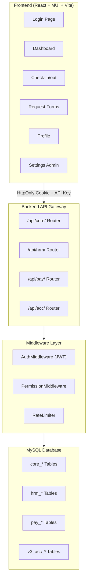
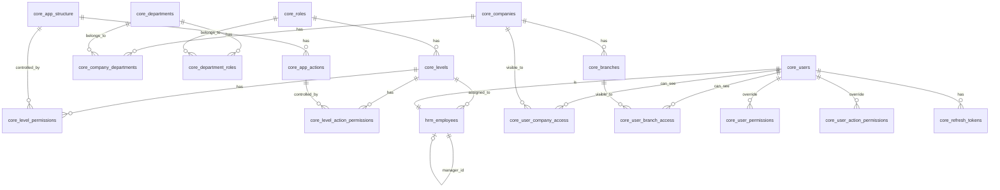

# TSD_01: Core Infrastructure

# Technical Specification Document

> **Version:** 1.0
> **Status:** ✅ เสร็จ (ตรวจเทียบ Code จริง 2026-03-10)
> **Last Updated:** 2026-03-10
> **PRD Reference:** PRD #00 (Permission Architecture), PRD #01 (Main System), PRD #04 (Settings System)
> **Author:** Software Architect

---

## 1. ภาพรวมและขอบเขต (Overview & Scope)

### 1.1 สรุปจาก PRD

TSD นี้ครอบคลุม **Core Platform Infrastructure** ซึ่งเป็นฐานรากที่โมดูลอื่นทั้งหมด (HRM, Payroll, ACC) ต้องพึ่งพา ประกอบด้วย:

- **Authentication** — JWT Login, Token Refresh, Logout, Protected Routes
- **Permission Engine** — Level-Based + User Override, Action-Based Protection
- **Company/Branch Visibility** — การมองเห็นข้อมูลข้ามบริษัท/สาขา
- **Dashboard** — Calendar (21-20 Cycle), Stats Summary
- **Check-in/Check-out** — GPS Verification, ONSITE/OFFSITE
- **Request Forms** — ศูนย์รวมคำร้อง (Leave, OT, Time Correction, Shift Swap)
- **Profile** — ข้อมูลส่วนตัวพนักงาน
- **Settings Admin** — Master Data Management, System Config, Permission UI
- **App Structure & Menu** — Dynamic Menu Tree, Navbar/Sidebar Rendering

### 1.2 ขอบเขต

| ทำ (In Scope)                             | ไม่ทำ (Out of Scope)                     |
| :---------------------------------------- | :--------------------------------------- |
| Authentication & Authorization ทั้งระบบ   | Business Logic เฉพาะ HR (ดู TSD_02)      |
| Permission Engine & Middleware            | การคำนวณ OT/เงินเดือน (ดู TSD_03)        |
| Dashboard & Check-in/Check-out            | ระบบบัญชี ACC (ดู TSD_04)                |
| Request Forms (โครงสร้าง + Approval Flow) | รายละเอียด Leave Quota Logic (ดู TSD_02) |
| Settings Admin UI + System Config         | —                                        |
| API Gateway Architecture                  | —                                        |

### 1.3 Dependencies กับ TSD อื่น

| TSD              | ความสัมพันธ์                                                        |
| :--------------- | :------------------------------------------------------------------ |
| TSD_02 (HRM)     | ใช้ Permission Engine, Auth Middleware, Request Form Infrastructure |
| TSD_03 (Payroll) | ใช้ Permission Engine, System Config (เช่น Social Security Rate)    |
| TSD_04 (ACC)     | ใช้ Permission Engine, Auth Middleware, แยก API Router              |

---

## 2. Tech Stack & Architecture

### 2.1 เทคโนโลยี

| Layer           | เทคโนโลยี                           | Version | หมายเหตุ                       |
| :-------------- | :---------------------------------- | :------ | :----------------------------- |
| **Frontend**    | React (JSX)                         | 18.x    | UI Framework                   |
| **UI Library**  | MUI (Material UI)                   | 6.x     | Component Library + Theming    |
| **Build Tool**  | Vite                                | 6.x     | Dev Server + Production Build  |
| **CSS**         | MUI `sx` prop + TailwindCSS (เสริม) | 4.x     | Hybrid Styling                 |
| **HTTP Client** | Axios                               | 1.x     | API Communication              |
| **Routing**     | react-router-dom                    | 7.x     | SPA Client-Side Routing        |
| **Alerts**      | SweetAlert2                         | 11.x    | Notification / Confirm Dialogs |
| **Backend**     | Pure PHP (RESTful API)              | 8.x     | Model-Based Architecture       |
| **Database**    | MySQL (InnoDB)                      | 8.x     | PDO Prepared Statements        |
| **Auth**        | JWT (firebase/php-jwt)              | —       | HttpOnly Cookie Storage        |
| **Maps**        | Google Maps JavaScript API          | —       | Check-in GPS Verification      |

### 2.2 Database Connection

> **อ้างอิง:** `ref/con_DB.png`

| Parameter    | ค่า (Development) | ค่า (Production)    |
| :----------- | :---------------- | :------------------ |
| **Server**   | MySQL             | MySQL               |
| **Host**     | `127.0.0.1`       | _(ตาม Server จริง)_ |
| **Port**     | `3306`            | `3306`              |
| **Username** | `root`            | _(ตาม Server จริง)_ |
| **Password** | _(ว่าง)_          | _(ตาม Server จริง)_ |
| **Database** | `siamgroup_v3`    | `siamgroup_v3`      |
| **Charset**  | `utf8mb4`         | `utf8mb4`           |

#### `.env` Config Template

```env
# Database
DB_HOST=127.0.0.1
DB_PORT=3306
DB_NAME=siamgroup_v3
DB_USER=root
DB_PASS=

# Security
API_SECRET_KEY=your_api_key_here
JWT_SECRET=your_jwt_secret_here

# Google Maps
GOOGLE_MAPS_API_KEY=your_google_maps_key

# Telegram
TELEGRAM_BOT_TOKEN=your_bot_token
TELEGRAM_CHAT_ID=your_chat_id

# SMTP
SMTP_HOST=smtp.example.com
SMTP_PORT=587
SMTP_USER=noreply@siamgroup.com
SMTP_PASS=your_smtp_password
```

#### `config/config.php` Connection Pattern

```php
<?php
// Load .env
$envFile = __DIR__ . '/../.env';
if (file_exists($envFile)) {
    $lines = file($envFile, FILE_IGNORE_NEW_LINES | FILE_SKIP_EMPTY_LINES);
    foreach ($lines as $line) {
        if (strpos($line, '#') === 0) continue;
        putenv($line);
    }
}

// PDO Connection
try {
    $dsn = sprintf(
        'mysql:host=%s;port=%s;dbname=%s;charset=utf8mb4',
        getenv('DB_HOST'),
        getenv('DB_PORT'),
        getenv('DB_NAME')
    );
    $pdo = new PDO($dsn, getenv('DB_USER'), getenv('DB_PASS'), [
        PDO::ATTR_ERRMODE            => PDO::ERRMODE_EXCEPTION,
        PDO::ATTR_DEFAULT_FETCH_MODE => PDO::FETCH_ASSOC,
        PDO::ATTR_EMULATE_PREPARES   => false,
    ]);
} catch (PDOException $e) {
    http_response_code(500);
    echo json_encode(['status' => 'error', 'message' => 'Database connection failed']);
    exit;
}
```

### 2.3 Architecture Pattern: Modular API Gateway

> **ตัดสินใจ:** ใช้ **Option B — แยก Router per Module** (Clean URL)

```
backend/
├── .env
├── .htaccess                    # URL Rewriting → Clean URLs
├── config/
│   └── config.php               # DB Connection + ENV Loading
├── middleware/
│   ├── AuthMiddleware.php       # JWT Verification + Token Refresh
│   ├── PermissionMiddleware.php # Level + User Override Check
│   └── RateLimiter.php          # Brute-force Prevention
├── core/                        # 🆕 Module: Core
│   ├── index.php                # Router สำหรับ /api/core/*
│   └── models/
│       ├── BaseModel.php
│       ├── User.php
│       ├── AppStructure.php
│       ├── Permission.php
│       ├── SystemConfig.php
│       └── ...
├── hrm/                         # Module: HRM (TSD_02)
│   ├── index.php                # Router สำหรับ /api/hrm/*
│   └── models/
├── pay/                         # Module: Payroll (TSD_03)
│   ├── index.php                # Router สำหรับ /api/pay/*
│   └── models/
└── acc/                         # Module: ACC (TSD_04)
    ├── index.php                # Router สำหรับ /api/acc/*
    └── models/
```

### 2.4 URL Routing Structure

```
/api/core/auth/login          POST   — Login
/api/core/auth/refresh        POST   — Token Refresh
/api/core/auth/logout         POST   — Logout
/api/core/dashboard           GET    — Dashboard Data
/api/core/checkin             POST   — Check-in/Check-out
/api/core/requests/*          CRUD   — Request Forms
/api/core/profile/*           GET/PUT — Profile
/api/core/settings/*          CRUD   — Settings Admin

/api/hrm/*                    →  HRM Module (TSD_02)
/api/pay/*                    →  Payroll Module (TSD_03)
/api/acc/*                    →  ACC Module (TSD_04)
```

### 2.5 .htaccess Rewrite Rules

```apache
RewriteEngine On
RewriteBase /v3_1/backend/

# Route /api/core/* → core/index.php
RewriteRule ^api/core/(.*)$ core/index.php?route=$1 [QSA,L]

# Route /api/hrm/* → hrm/index.php
RewriteRule ^api/hrm/(.*)$ hrm/index.php?route=$1 [QSA,L]

# Route /api/pay/* → pay/index.php
RewriteRule ^api/pay/(.*)$ pay/index.php?route=$1 [QSA,L]

# Route /api/acc/* → acc/index.php
RewriteRule ^api/acc/(.*)$ acc/index.php?route=$1 [QSA,L]
```

### 2.6 System Architecture Diagram



### 2.7 Frontend Project Structure (V3.1)

```
frontend/
├── index.html
├── vite.config.js              # base: '/v3_1/'
├── src/
│   ├── main.jsx                # ThemeProvider + App Render
│   ├── App.jsx                 # BrowserRouter + Routes
│   ├── index.css
│   ├── views/                  # Page-level (1 route = 1 file)
│   │   ├── MainLayout.jsx      # AppBar + Sidebar + Outlet
│   │   ├── Login.jsx
│   │   ├── Dashboard.jsx
│   │   ├── CheckInOut.jsx
│   │   ├── RequestCenter.jsx
│   │   ├── Profile.jsx
│   │   └── settings/           # Settings sub-pages
│   │       ├── SettingsLayout.jsx
│   │       ├── CompanySettings.jsx
│   │       ├── BranchSettings.jsx
│   │       ├── OrgStructure.jsx
│   │       ├── PermissionMatrix.jsx
│   │       ├── AppStructureManager.jsx
│   │       ├── SystemConfigPage.jsx
│   │       └── AdminUsers.jsx
│   ├── subviews/               # Tab/Section content
│   ├── component/              # Reusable components
│   │   ├── ProtectedRoute.jsx
│   │   ├── PermissionGate.jsx  # 🆕 Wrap component ตาม Action permission
│   │   ├── StatusBadge.jsx
│   │   ├── CalendarGrid.jsx
│   │   ├── GoogleMap.jsx
│   │   └── ...
│   ├── context/
│   │   └── AuthContext.jsx
│   ├── services/
│   │   ├── api.js              # Axios instance + interceptors
│   │   ├── authService.js      # Login/Logout/Refresh
│   │   ├── dashboardService.js
│   │   ├── checkinService.js
│   │   ├── requestService.js
│   │   └── settingsService.js
│   ├── hooks/                  # 🆕 Custom Hooks
│   │   ├── usePermission.js    # Check page/action permission
│   │   └── useCompanyVisibility.js
│   └── utils/
│       ├── dateUtils.js        # 21-20 cycle helpers
│       └── gpsUtils.js         # Distance calculation
```

---

## 3. Database Schema (โครงสร้างฐานข้อมูล)

### 3.1 ER Diagram — Core Tables



### 3.2 Table Definitions

> **หมายเหตุ:** ตาราง `hrm_employees` อยู่ใน schema ของ HRM แต่ Core ต้องใช้ JOIN ด้วย

#### 3.2.1 `core_users` (ตารางที่มีอยู่ — ต้องเพิ่มฟิลด์)

```sql
CREATE TABLE `core_users` (
    `id` BIGINT UNSIGNED AUTO_INCREMENT PRIMARY KEY,
    `username` VARCHAR(50) NOT NULL UNIQUE,
    `password_hash` VARCHAR(255) NOT NULL COMMENT 'bcrypt cost >= 12',
    `first_name_th` VARCHAR(100) NOT NULL,
    `last_name_th` VARCHAR(100) NOT NULL,
    `first_name_en` VARCHAR(100) NULL,
    `last_name_en` VARCHAR(100) NULL,
    `nickname` VARCHAR(50) NULL,
    `email` VARCHAR(255) NULL,
    `phone` VARCHAR(20) NULL,
    `avatar_url` VARCHAR(500) NULL,
    `gender` ENUM('MALE','FEMALE','OTHER') NULL,
    `birth_date` DATE NULL,
    `is_admin` TINYINT(1) DEFAULT 0 COMMENT '1 = เข้าถึง Settings ทั้งหมด',
    `is_active` TINYINT(1) DEFAULT 1,
    `last_login_at` DATETIME NULL,
    `last_login_ip` VARCHAR(45) NULL,
    `failed_login_count` INT DEFAULT 0 COMMENT '🆕 นับ Login ผิด',
    `locked_until` DATETIME NULL COMMENT '🆕 ล็อกถึงเมื่อไหร่',
    `created_at` TIMESTAMP DEFAULT CURRENT_TIMESTAMP,
    `updated_at` TIMESTAMP DEFAULT CURRENT_TIMESTAMP ON UPDATE CURRENT_TIMESTAMP
) ENGINE=InnoDB DEFAULT CHARSET=utf8mb4;
```

#### 3.2.2 `core_refresh_tokens` 🆕 (Token Blacklist + Storage)

```sql
CREATE TABLE `core_refresh_tokens` (
    `id` BIGINT UNSIGNED AUTO_INCREMENT PRIMARY KEY,
    `user_id` BIGINT UNSIGNED NOT NULL,
    `token_hash` VARCHAR(255) NOT NULL COMMENT 'SHA-256 hash ของ Refresh Token',
    `expires_at` DATETIME NOT NULL,
    `is_revoked` TINYINT(1) DEFAULT 0 COMMENT '1 = ถูก Revoke (Logout/Blacklist)',
    `created_at` TIMESTAMP DEFAULT CURRENT_TIMESTAMP,
    `user_agent` VARCHAR(500) NULL,
    `ip_address` VARCHAR(45) NULL,
    CONSTRAINT `fk_rt_user` FOREIGN KEY (`user_id`) REFERENCES `core_users` (`id`),
    INDEX `idx_token_hash` (`token_hash`),
    INDEX `idx_user_active` (`user_id`, `is_revoked`, `expires_at`)
) ENGINE=InnoDB DEFAULT CHARSET=utf8mb4 COMMENT='JWT Refresh Token Storage';
```

#### 3.2.3 `core_companies` (มีอยู่ — เพิ่ม `company_type`)

```sql
CREATE TABLE `core_companies` (
    `id` INT AUTO_INCREMENT PRIMARY KEY,
    `code` VARCHAR(10) NOT NULL UNIQUE COMMENT 'SDR, SXD, SPD, SAR',
    `name_th` VARCHAR(200) NOT NULL,
    `name_en` VARCHAR(200) NULL,
    `company_type` ENUM('DHL','CAR_RENTAL') NOT NULL COMMENT '🆕 ประเภทธุรกิจ',
    `type` ENUM('HEADQUARTER','SUBSIDIARY') NOT NULL,
    `tax_id` VARCHAR(20) NULL,
    `logo_url` VARCHAR(500) NULL,
    `address` TEXT NULL,
    `phone` VARCHAR(20) NULL,
    `email` VARCHAR(255) NULL,
    `website` VARCHAR(255) NULL,
    `is_active` TINYINT(1) DEFAULT 1,
    `created_at` TIMESTAMP DEFAULT CURRENT_TIMESTAMP,
    `updated_at` TIMESTAMP DEFAULT CURRENT_TIMESTAMP ON UPDATE CURRENT_TIMESTAMP
) ENGINE=InnoDB DEFAULT CHARSET=utf8mb4;
```

#### 3.2.4 `core_branches` (มีอยู่ — ไม่เปลี่ยน)

```sql
CREATE TABLE `core_branches` (
    `id` INT UNSIGNED AUTO_INCREMENT PRIMARY KEY,
    `company_id` INT NOT NULL,
    `code` VARCHAR(20) NOT NULL,
    `name_th` VARCHAR(200) NOT NULL,
    `name_en` VARCHAR(200) NULL,
    `address` TEXT NULL,
    `latitude` DECIMAL(10,7) NULL,
    `longitude` DECIMAL(10,7) NULL,
    `check_radius` INT DEFAULT 200 COMMENT 'รัศมี Check-in (เมตร)',
    `peak_category` VARCHAR(50) NULL,
    `mapping_code` VARCHAR(50) NULL,
    `is_active` TINYINT(1) DEFAULT 1,
    `created_at` TIMESTAMP DEFAULT CURRENT_TIMESTAMP,
    `updated_at` TIMESTAMP DEFAULT CURRENT_TIMESTAMP ON UPDATE CURRENT_TIMESTAMP,
    CONSTRAINT `fk_branch_company` FOREIGN KEY (`company_id`) REFERENCES `core_companies` (`id`)
) ENGINE=InnoDB DEFAULT CHARSET=utf8mb4;
```

#### 3.2.5 `core_departments` (แก้ไข — ลบ `company_id`)

```sql
CREATE TABLE `core_departments` (
    `id` INT AUTO_INCREMENT PRIMARY KEY,
    `name` VARCHAR(100) NOT NULL,
    `name_en` VARCHAR(100) NULL,
    `is_active` TINYINT(1) DEFAULT 1,
    `created_at` TIMESTAMP DEFAULT CURRENT_TIMESTAMP,
    `updated_at` TIMESTAMP DEFAULT CURRENT_TIMESTAMP ON UPDATE CURRENT_TIMESTAMP
) ENGINE=InnoDB DEFAULT CHARSET=utf8mb4;
```

#### 3.2.6 Junction Tables (จาก PRD #00)

> ตาราง Junction ทั้งหมดตาม PRD #00 Section 4.2 — 4.3:
> `core_company_departments`, `core_department_roles`, `core_user_company_access`, `core_user_branch_access`
>
> SQL สร้างตาราง: ดู PRD #00 Section 4.2 (ไม่เปลี่ยนจาก PRD)

#### 3.2.7 `core_roles` (ไม่เปลี่ยน)

```sql
CREATE TABLE `core_roles` (
    `id` INT AUTO_INCREMENT PRIMARY KEY,
    `name_th` VARCHAR(100) NOT NULL,
    `name_en` VARCHAR(100) NOT NULL,
    `created_at` TIMESTAMP DEFAULT CURRENT_TIMESTAMP,
    `updated_at` TIMESTAMP DEFAULT CURRENT_TIMESTAMP ON UPDATE CURRENT_TIMESTAMP
) ENGINE=InnoDB DEFAULT CHARSET=utf8mb4;
```

#### 3.2.8 `core_levels` (แก้ไข — ลบ `department_id`)

```sql
CREATE TABLE `core_levels` (
    `id` INT AUTO_INCREMENT PRIMARY KEY,
    `role_id` INT NOT NULL,
    `level_score` INT DEFAULT 10 COMMENT '1=สูงสุด, 8=ต่ำสุด',
    `name` VARCHAR(100) NULL COMMENT 'ชื่อตำแหน่งจริง เช่น MD, Programmer',
    `description` VARCHAR(255) NULL,
    `created_at` TIMESTAMP DEFAULT CURRENT_TIMESTAMP,
    `updated_at` TIMESTAMP DEFAULT CURRENT_TIMESTAMP ON UPDATE CURRENT_TIMESTAMP,
    CONSTRAINT `fk_level_role` FOREIGN KEY (`role_id`) REFERENCES `core_roles` (`id`)
) ENGINE=InnoDB DEFAULT CHARSET=utf8mb4;
```

#### 3.2.9 Permission Tables (จาก PRD #00 Section 7)

> ตาราง Permission ทั้งหมด:
> `core_app_structure` (มีอยู่), `core_level_permissions` (มีอยู่),
> `core_app_actions` 🆕, `core_level_action_permissions` 🆕,
> `core_user_permissions` 🆕, `core_user_action_permissions` 🆕
>
> SQL สร้างตาราง: ดู PRD #00 Section 7.3 (ไม่เปลี่ยนจาก PRD)

#### 3.2.10 `core_system_config` 🆕

> SQL สร้างตาราง + Seed Data: ดู PRD #04 Section 10 (ไม่เปลี่ยนจาก PRD)

### 3.3 สรุปตารางทั้งหมดใน TSD_01

| #   | ตาราง                           | สถานะ      | หมายเหตุ                                   |
| :-- | :------------------------------ | :--------- | :----------------------------------------- |
| 1   | `core_users`                    | แก้ไข      | เพิ่ม `failed_login_count`, `locked_until` |
| 2   | `core_refresh_tokens`           | 🆕 ใหม่    | JWT Refresh Token Storage                  |
| 3   | `core_companies`                | แก้ไข      | เพิ่ม `company_type`                       |
| 4   | `core_branches`                 | ไม่เปลี่ยน | —                                          |
| 5   | `core_departments`              | แก้ไข      | ลบ `company_id`                            |
| 6   | `core_company_departments`      | 🆕 ใหม่    | Junction: บ. ↔ แผนก                        |
| 7   | `core_department_roles`         | 🆕 ใหม่    | Junction: แผนก ↔ Role                      |
| 8   | `core_roles`                    | ไม่เปลี่ยน | —                                          |
| 9   | `core_levels`                   | แก้ไข      | ลบ `department_id`                         |
| 10  | `core_app_structure`            | ไม่เปลี่ยน | —                                          |
| 11  | `core_app_actions`              | 🆕 ใหม่    | Action ภายในหน้า                           |
| 12  | `core_level_permissions`        | ไม่เปลี่ยน | สิทธิ์ Level ต่อ Page                      |
| 13  | `core_level_action_permissions` | 🆕 ใหม่    | สิทธิ์ Level ต่อ Action                    |
| 14  | `core_user_permissions`         | 🆕 ใหม่    | Override User ต่อ Page                     |
| 15  | `core_user_action_permissions`  | 🆕 ใหม่    | Override User ต่อ Action                   |
| 16  | `core_user_company_access`      | 🆕 ใหม่    | บ. ที่เห็น                                 |
| 17  | `core_user_branch_access`       | 🆕 ใหม่    | สาขาที่เห็น (Override)                     |
| 18  | `core_system_config`            | 🆕 ใหม่    | ค่าคงที่ระบบ                               |
| 19  | `hrm_employee_documents`        | 🆕 ใหม่    | เอกสารพนักงาน (Profile)                    |

---

## 4. API Endpoints (จุดเชื่อมต่อ API)

### 4.1 Shared Headers (ทุก Request)

```
X-API-Key: {API_SECRET_KEY}           # บังคับทุก Request
Cookie: access_token={JWT}            # อัตโนมัติจาก Browser (ยกเว้น Login)
Content-Type: application/json
```

### 4.2 Standard Response Format

```json
// Success
{ "status": "success", "data": { ... }, "message": "..." }

// Error
{ "status": "error", "error_code": "AUTH_FAILED", "message": "..." }
```

### 4.3 Authentication APIs

| Method | Path                             | Auth              | คำอธิบาย                             |
| :----- | :------------------------------- | :---------------- | :----------------------------------- |
| `POST` | `/api/core/auth/login`           | ❌ ไม่ต้อง        | Login → คืน User Object + Set Cookie |
| `POST` | `/api/core/auth/refresh`         | 🔄 Refresh Cookie | ขอ Access Token ใหม่                 |
| `POST` | `/api/core/auth/logout`          | ✅ ต้อง           | Revoke Token + ลบ Cookie             |
| `POST` | `/api/core/auth/change-password` | ✅ ต้อง           | เปลี่ยนรหัสผ่าน                      |

### 4.4 Dashboard APIs

| Method | Path                       | Auth | คำอธิบาย                            |
| :----- | :------------------------- | :--- | :---------------------------------- |
| `GET`  | `/api/core/dashboard`      | ✅   | ข้อมูล Dashboard (Calendar + Stats) |
| `GET`  | `/api/core/dashboard/team` | ✅   | ข้อมูลลูกน้อง (เฉพาะหัวหน้า)        |

### 4.5 Check-in/Check-out APIs

| Method | Path                       | Auth | คำอธิบาย                  |
| :----- | :------------------------- | :--- | :------------------------ |
| `POST` | `/api/core/checkin`        | ✅   | บันทึก Check-in/Check-out |
| `GET`  | `/api/core/checkin/status` | ✅   | สถานะ Check-in วันนี้     |

### 4.6 Request Form APIs

| Method | Path                                 | Auth | คำอธิบาย                         |
| :----- | :----------------------------------- | :--- | :------------------------------- |
| `GET`  | `/api/core/requests`                 | ✅   | รายการคำร้องของฉัน               |
| `POST` | `/api/core/requests/leave`           | ✅   | สร้างคำร้องลา                    |
| `POST` | `/api/core/requests/ot`              | ✅   | สร้างคำร้อง OT                   |
| `POST` | `/api/core/requests/time-correction` | ✅   | สร้างคำร้องแก้เวลา               |
| `POST` | `/api/core/requests/shift-swap`      | ✅   | สร้างคำร้องสลับกะ                |
| `PUT`  | `/api/core/requests/{id}/cancel`     | ✅   | ยกเลิกคำร้อง (PENDING เท่านั้น)  |
| `PUT`  | `/api/core/requests/{id}/approve`    | ✅   | อนุมัติคำร้อง (manager เท่านั้น) |
| `PUT`  | `/api/core/requests/{id}/reject`     | ✅   | ปฏิเสธคำร้อง (manager เท่านั้น)  |

### 4.7 Profile APIs

| Method | Path                         | Auth | คำอธิบาย                           |
| :----- | :--------------------------- | :--- | :--------------------------------- |
| `GET`  | `/api/core/profile`          | ✅   | ข้อมูลส่วนตัว                      |
| `PUT`  | `/api/core/profile`          | ✅   | แก้ไขข้อมูล (phone, email, avatar) |
| `PUT`  | `/api/core/profile/password` | ✅   | เปลี่ยนรหัสผ่าน                    |

### 4.8 Settings APIs (ต้อง `is_admin = 1`)

| Method    | Path                                           | Auth                | คำอธิบาย                  |
| :-------- | :--------------------------------------------- | :------------------ | :------------------------ |
| `GET/PUT` | `/api/core/settings/companies`                 | 🔒 Admin            | จัดการบริษัท (Edit Only)  |
| `GET/PUT` | `/api/core/settings/branches`                  | 🔒 Admin            | จัดการสาขา (Edit Only)    |
| `CRUD`    | `/api/core/settings/departments`               | 🔒 Admin            | จัดการแผนก                |
| `CRUD`    | `/api/core/settings/roles`                     | 🔒 Admin            | จัดการตำแหน่ง             |
| `CRUD`    | `/api/core/settings/levels`                    | 🔒 Admin            | จัดการระดับ               |
| `GET/PUT` | `/api/core/settings/permissions/matrix`        | 🔒 Admin            | Matrix Level × Page       |
| `CRUD`    | `/api/core/settings/permissions/user-override` | 🔒 Admin            | User Override             |
| `CRUD`    | `/api/core/settings/permissions/visibility`    | 🔒 Admin            | Company/Branch Visibility |
| `CRUD`    | `/api/core/settings/app-structure`             | 🔒 Admin/Permission | โครงสร้างเมนู             |
| `CRUD`    | `/api/core/settings/app-actions`               | 🔒 Admin/Permission | Actions                   |
| `GET/PUT` | `/api/core/settings/system-config`             | 🔒 Admin            | ค่าคงที่ระบบ              |
| `GET/PUT` | `/api/core/settings/admin-users`               | 🔒 Admin            | จัดการ Admin              |

---

## 5. Business Logic & Rules (ตรรกะทางธุรกิจ)

### 5.1 Authentication Logic

#### Login Flow

```
POST /api/core/auth/login
Body: { username, password }

1. ตรวจสอบ Rate Limiting:
   - ถ้า locked_until > NOW() → 403 "บัญชีถูกล็อกชั่วคราว"

2. ค้นหา core_users WHERE username = ? AND is_active = 1

3. ตรวจสอบ password:
   - bcrypt_verify(password, password_hash)
   - ถ้าผิด → failed_login_count + 1
   - ถ้า failed_login_count >= LOGIN_MAX_ATTEMPTS (จาก system_config)
     → locked_until = NOW() + 30 นาที
     → แจ้ง Admin ทาง Telegram
   - Response: 401 "ชื่อผู้ใช้หรือรหัสผ่านไม่ถูกต้อง" (ไม่เจาะจง)

4. สำเร็จ:
   - Reset failed_login_count = 0, locked_until = NULL
   - สร้าง Access Token (JWT, exp = 30 นาที)
   - สร้าง Refresh Token (JWT, exp = 7 วัน)
   - บันทึก Refresh Token hash → core_refresh_tokens
   - Set HttpOnly Cookies
   - บันทึก last_login_at, last_login_ip
   - Query Menu Tree → core_app_structure + core_level_permissions
   - Query Permissions → actions ที่มีสิทธิ์
   - Response: { user_object, menu_tree, permissions }
```

#### JWT Payload

```json
{
  "sub": 123, // user_id
  "emp": 456, // employee_id
  "cmp": 1, // company_id
  "brn": 5, // branch_id
  "lvl": 12, // level_id
  "adm": false, // is_admin
  "iat": 1709600000,
  "exp": 1709601800 // 30 min
}
```

#### Cookie Settings

```php
setcookie('access_token', $jwt, [
    'expires'  => 0,                    // Session cookie
    'path'     => '/v3_1/backend/api/',
    'domain'   => '',
    'secure'   => true,                 // HTTPS only
    'httponly'  => true,                 // No JS access
    'samesite' => 'Lax'                 // CSRF protection
]);
```

### 5.2 Permission Check Logic

```
ฟังก์ชัน checkPagePermission(user_id, level_id, page_id):
  1. ดู core_user_permissions (user_id + app_structure_id)
     → มี: is_granted=1 → ✅ / is_granted=0 → ❌
  2. ไม่มี → ดู core_level_permissions (level_id + app_structure_id)
     → มี → ✅
  3. ไม่มีทั้ง 2 → ❌

ฟังก์ชัน checkActionPermission(user_id, level_id, action_id):
  1. ดู core_user_action_permissions (user_id + action_id)
     → มี: is_granted=1 → ✅ / is_granted=0 → ❌
  2. ไม่มี → ดู core_level_action_permissions (level_id + action_id)
     → มี → ✅
  3. ไม่มีทั้ง 2 → ❌
```

### 5.3 Company/Branch Visibility Logic

```
ฟังก์ชัน getVisibleCompanies(user_id):
  1. ดู core_user_company_access WHERE user_id = ?
     → มี records → return บริษัทจากตารางนี้
  2. ไม่มี → Fallback: ดึงจาก core_company_departments
     (ผ่าน hrm_employees.level_id → core_levels.role_id
      → core_department_roles → core_company_departments)

ฟังก์ชัน getVisibleBranches(user_id, visible_companies):
  1. ดู core_user_branch_access WHERE user_id = ?
     → มี records:
       - ถ้า 1 บ. → สาขาตัวเอง + สาขาที่ override
       - ถ้าหลาย บ. → เฉพาะสาขาที่ระบุ (จำกัด)
  2. ไม่มี override:
     - ถ้า 1 บ. → สาขาตัวเอง (hrm_employees.branch_id)
     - ถ้าหลาย บ. → ทุกสาขาของทุก บ. ที่เห็น
```

### 5.4 Check-in Logic

```
POST /api/core/checkin
Body: { scan_type, latitude, longitude, offsite_reason?, offsite_attachment? }

1. ดึง location_type จาก hrm_work_schedules ของพนักงาน

2. ถ้า location_type = 'OFFICE' (ONSITE):
   - คำนวณระยะห่างจาก core_branches (lat, lng)
   - ถ้า distance > check_radius → 403 "กรุณาอยู่ในพื้นที่สาขา"
   - check_in_type = 'ONSITE', is_verified_location = 1

3. ถ้า location_type = 'ANYWHERE' (OFFSITE):
   - ไม่ตรวจรัศมี
   - ต้องมี offsite_reason (บังคับ)
   - ต้องมี offsite_attachment (บังคับ)
   - check_in_type = 'OFFSITE', is_verified_location = 0

4. Shared Device Detection:
   - เก็บ user_id ใน localStorage (client-side)
   - ถ้าพบ user_id อื่น → device_risk_flag = 1 (Silent Audit)

5. บันทึก → hrm_time_logs
```

### 5.5 Approval Flow (Request Forms)

```
สถานะ: PENDING → APPROVED / REJECTED / CANCELLED

Flow:
  พนักงาน สร้างคำร้อง → status = PENDING
  → แจ้งเตือน manager_id (Email + Telegram)
  → Manager กด Approve/Reject
  → แจ้งผลกลับพนักงาน (Email + Telegram)

กฎ:
  - CANCEL ได้เฉพาะตอน PENDING โดยผู้ขอเท่านั้น
  - APPROVE/REJECT ได้เฉพาะ manager ของผู้ขอ
  - กรณี SWAP: ทั้ง 2 คนเห็นคำร้อง
```

---

## 6. Security & Constraints (ความปลอดภัยและข้อจำกัด)

### 6.1 Authentication Security

| มาตรการ                | Implementation                                           |
| :--------------------- | :------------------------------------------------------- |
| JWT ใน HttpOnly Cookie | `httponly=true, secure=true, samesite=Lax`               |
| bcrypt Password Hash   | cost factor >= 12                                        |
| Rate Limiting          | 5 ครั้ง → ล็อก 30 นาที (configurable ผ่าน system_config) |
| Token Blacklist        | Refresh Token hash ใน `core_refresh_tokens.is_revoked`   |
| Error Obfuscation      | ไม่บอกว่า username/password ผิด                          |

### 6.2 API Security

| มาตรการ          | Implementation                        |
| :--------------- | :------------------------------------ |
| API Key          | Header `X-API-Key` ตรวจทุก Request    |
| CORS             | Whitelist เฉพาะ domain ที่กำหนด       |
| SQL Injection    | PDO Prepared Statements ทุก Query     |
| Input Validation | ตรวจ type + length + format           |
| Output Encoding  | htmlspecialchars() ป้องกัน Stored XSS |

### 6.3 Permission Enforcement

| ชั้น         | ตรวจที่ไหน                                                    |
| :----------- | :------------------------------------------------------------ |
| Route-level  | Middleware ตรวจ JWT validity                                  |
| Page-level   | Middleware ตรวจ `checkPagePermission()`                       |
| Action-level | Backend ตรวจ `checkActionPermission()` ก่อนทำ Business Logic  |
| Data-level   | SQL WHERE clause กรอง level_score + company/branch visibility |
| Settings     | ตรวจ `is_admin = 1` ทุก Settings API                          |

---

## 7. Dependencies & Integration Points

### 7.1 โมดูลที่ต้องพึ่งพา Core

| โมดูล            | ใช้อะไรจาก Core                                                                                     |
| :--------------- | :-------------------------------------------------------------------------------------------------- |
| TSD_02 (HRM)     | AuthMiddleware, PermissionMiddleware, Company/Branch Visibility, Approval Flow, Request Form tables |
| TSD_03 (Payroll) | AuthMiddleware, PermissionMiddleware, System Config (SOCIAL*SECURITY*_, PAYROLL*CYCLE*_)            |
| TSD_04 (ACC)     | AuthMiddleware, PermissionMiddleware, Company Visibility (เห็นเฉพาะ บ. ที่มีสิทธิ์)                 |

### 7.2 Shared Services

| Service                    | ใช้โดย     | คำอธิบาย                                |
| :------------------------- | :--------- | :-------------------------------------- |
| `AuthMiddleware.php`       | ทุก Module | JWT Verification                        |
| `PermissionMiddleware.php` | ทุก Module | Page/Action Permission Check            |
| `SystemConfig::get($key)`  | ทุก Module | ดึงค่าจาก `core_system_config` (Cached) |
| `NotificationService.php`  | ทุก Module | ส่ง Email + Telegram                    |
| `AuditLogger.php`          | ทุก Module | บันทึก Audit Trail                      |

### 7.3 External Services

| Service                    | ใช้ที่                        | API Key ที่ต้องมี          |
| :------------------------- | :---------------------------- | :------------------------- |
| Google Maps JavaScript API | Check-in/Check-out (Frontend) | `GOOGLE_MAPS_API_KEY`      |
| Telegram Bot API           | Notification (Backend)        | `TELEGRAM_BOT_TOKEN`       |
| SMTP Server                | Email Notification (Backend)  | SMTP credentials ใน `.env` |

---

## 8. Open Questions (คำถามที่ยังค้างอยู่)

| #   | คำถาม                                                                           | สถานะ         |
| :-- | :------------------------------------------------------------------------------ | :------------ |
| 1   | Theme / Color Palette สำหรับ V3.1 — ใช้สีอะไร? (ตอนนี้ ref มาจาก Thailand Post) | ⏳ รอตัดสินใจ |
| 2   | Notification Service — ใช้ Telegram Bot ตัวเดียวกับระบบเดิมหรือสร้างใหม่?       | ⏳ รอตัดสินใจ |
| 3   | File Upload Storage — เก็บไฟล์ไว้ที่ local disk หรือใช้ Cloud Storage (S3/GCS)? | ⏳ รอตัดสินใจ |

---

## 9. Schema Verification Log (ตรวจเทียบ Code จริง)

> ตรวจ 2026-03-10: เทียบ TSD กับ `001_core_schema.sql` + `core/index.php` + `models/*.php`

### ✅ ตรงกัน (19/19 ตาราง)

| Table                           | TSD    | SQL          | Status                                 |
| :------------------------------ | :----- | :----------- | :------------------------------------- |
| `core_companies`                | 3.2.3  | Line 13-29   | ✅ ตรงกัน                              |
| `core_branches`                 | 3.2.4  | Line 34-50   | ✅ ตรงกัน                              |
| `core_departments`              | 3.2.5  | Line 55-62   | ✅ ตรงกัน (ไม่มี company_id ตามแผน)    |
| `core_company_departments`      | 3.2.6  | Line 67-73   | ✅ ตรงกัน                              |
| `core_roles`                    | 3.2.7  | Line 78-84   | ✅ ตรงกัน                              |
| `core_department_roles`         | 3.2.6  | Line 89-95   | ✅ ตรงกัน                              |
| `core_levels`                   | 3.2.8  | Line 100-109 | ✅ ตรงกัน (ไม่มี department_id ตามแผน) |
| `core_users`                    | 3.2.1  | Line 114-136 | ✅ ตรงกัน                              |
| `core_refresh_tokens`           | 3.2.2  | Line 141-153 | ✅ ตรงกัน                              |
| `core_app_structure`            | 3.2.9  | Line 158-173 | ✅ ตรงกัน                              |
| `core_app_actions`              | 3.2.9  | Line 178-188 | ✅ ตรงกัน                              |
| `core_level_permissions`        | 3.2.9  | Line 193-199 | ✅ ตรงกัน                              |
| `core_level_action_permissions` | 3.2.9  | Line 204-210 | ✅ ตรงกัน                              |
| `core_user_permissions`         | 3.2.9  | Line 215-224 | ✅ ตรงกัน                              |
| `core_user_action_permissions`  | 3.2.9  | Line 229-238 | ✅ ตรงกัน                              |
| `core_user_company_access`      | 3.2.6  | Line 243-249 | ✅ ตรงกัน                              |
| `core_user_branch_access`       | 3.2.6  | Line 254-260 | ✅ ตรงกัน                              |
| `core_system_config`            | 3.2.10 | Line 265-273 | ✅ ตรงกัน                              |
| `hrm_employees`                 | Note   | Line 278-298 | ✅ ตรงกัน                              |

### ✅ API Routes ตรวจแล้ว (core/index.php, 688 lines)

| Group       | Routes (จาก Code จริง)                                                                                               | TSD Section | Status                                    |
| :---------- | :------------------------------------------------------------------------------------------------------------------- | :---------- | :---------------------------------------- |
| `auth`      | login, refresh, logout, me                                                                                           | 4.3         | ✅ มี `me` เพิ่ม (ไม่มีใน TSD เดิม)       |
| `dashboard` | calendar/index, summary                                                                                              | 4.4         | ✅ ตรง                                    |
| `checkin`   | status, clock (POST), history                                                                                        | 4.5         | ✅ มี `history` เพิ่ม                     |
| `requests`  | list, leave, ot, time-correction, shift-swap, {id}/cancel, leave-types, leave-quotas                                 | 4.6         | ✅ มี `leave-types`, `leave-quotas` เพิ่ม |
| `profile`   | index, update, password, leave-history, ot-history                                                                   | 4.7         | ✅ มี `leave-history`, `ot-history` เพิ่ม |
| `settings`  | companies, branches, departments, roles, levels, system-config, admin-users, permissions, app-structure, app-actions | 4.8         | ✅ ตรง                                    |

### ⚠️ สิ่งที่พบ (Minor Differences)

| #   | สิ่งที่พบ                                        | รายละเอียด                                                             | ผลกระทบ                                             |
| :-- | :----------------------------------------------- | :--------------------------------------------------------------------- | :-------------------------------------------------- |
| 1   | `auth/me` API                                    | Code มี (/api/core/auth/me) แต่ TSD ไม่ได้ระบุ                         | ✅ ไม่กระทบ — ใช้สำหรับ re-auth on page reload      |
| 2   | `checkin/history` API                            | Code มี (/api/core/checkin/history) แต่ TSD ไม่ได้ระบุ                 | ✅ ไม่กระทบ — ใช้แสดงประวัติ Check-in/out           |
| 3   | `profile/leave-history` + `profile/ot-history`   | Code มี แต่ TSD ไม่ได้ระบุ                                             | ✅ ไม่กระทบ — ใช้แสดงประวัติใน Profile              |
| 4   | `requests/leave-types` + `requests/leave-quotas` | Code มี แต่ TSD ยังไม่ระบุ (ใช้ในหน้า Request Center)                  | ✅ ไม่กระทบ                                         |
| 5   | React/MUI version                                | TSD ระบุ React 19.x + MUI 7.x → Code จริงใช้ React 18.x + MUI 6.x      | ✅ แก้ไข TSD แล้ว                                   |
| 6   | `hrm_employees.status` ENUM                      | ไม่มี `CONTRACT` → ใช้เฉพาะ PROBATION, FULL_TIME, RESIGNED, TERMINATED | ⚠️ TSD_02 อ้าง CONTRACT — ต้องตั้ง ALTER ถ้าต้องการ |
