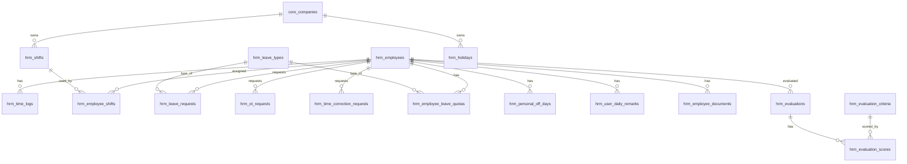

# TSD_02: HRM Module

# Technical Specification Document

> **Version:** 1.0
> **Status:** ✅ เสร็จ (อ้างอิงจาก Code จริง)
> **Last Updated:** 2026-03-10
> **PRD Reference:** PRD #02 (HR System)
> **Dependencies:** TSD_01 (Core Infrastructure)

---

## 1. ภาพรวมและขอบเขต (Overview & Scope)

### 1.1 สรุป

ระบบ HR Management สำหรับฝ่าย HR, หัวหน้างาน และผู้บริหาร ครอบคลุม:

- จัดการข้อมูลพนักงาน (CRUD + เอกสาร + Subordinates)
- รายงานเวลาทำงาน (Time Report — Calendar Grid 21-20 + Daily Breakdown + Summary)
- จัดการตารางกะ (Work Schedule — FIXED/FLEXIBLE, เสาร์เว้นเสาร์)
- จัดการวันหยุด (Holiday + Personal Off Days)
- จัดการสิทธิ์ลา (Leave Type CRUD + Leave Quota per Year)
- อนุมัติคำร้อง (Leave, OT, Time Correction, Shift Swap — Unified Approval)
- ระบบประเมินผลงาน (Performance Evaluation — 5 หมวด, คะแนน 1-5, น้ำหนักถ่วง)
- รายงานสรุป (Employee Status, Attendance, OT, Leave — 4 tab)

### 1.2 ขอบเขต

| ทำ (In Scope)                                 | ไม่ทำ (Out of Scope)             |
| :-------------------------------------------- | :------------------------------- |
| Employee CRUD + Documents + Filter            | Payroll Calculation (→ TSD_03)   |
| Time Report (Calendar 21-20 + Daily + Remark) | Payslip Generation (→ TSD_03)    |
| Work Schedule CRUD + Assign + Bulk            | Accounting/Expenses (→ TSD_04)   |
| Holiday CRUD + Personal Off Days              | Recruitment/Onboarding           |
| Leave Types + Quotas + Requests               | Training Management              |
| Unified Approval (Leave/OT/TC/SS)             | Employee Self-Service Portal     |
| Performance Evaluation (5 criteria, star)     | Notification (Telegram/Email) ⏳ |
| Summary Reports (4 types)                     | Excel Import/Export ⏳           |

### 1.3 ผู้ใช้งาน

| กลุ่ม         | การเข้าถึง                          |
| :------------ | :---------------------------------- |
| HR            | เข้าถึงทุกเมนู HR                   |
| IT            | เข้าถึงทุกเมนู (`is_cross_company`) |
| หัวหน้า       | ตาม `core_level_permissions`        |
| พนักงานทั่วไป | ❌ ไม่มีสิทธิ์เข้าเมนู HR           |

---

## 2. Tech Stack & Architecture

- **Backend**: Pure PHP, Model-Based Architecture, RESTful API
- **Database**: MySQL 8.0, `utf8mb4` charset
- **Frontend**: React 18 + MUI v6, Vite, Axios
- **Auth**: JWT via HttpOnly Cookies (จาก TSD_01)
- **API Prefix**: `/api/hrm/*` (ผ่าน `.htaccess` Rewrite)

### 2.1 Backend Structure

```
backend/hrm/
├── index.php              # Router — 8 resources, 35+ endpoints
└── models/
    ├── HrmEmployee.php    # Employee CRUD + Documents + Subordinates
    ├── HrmTimeReport.php  # Calendar Grid (21-20), Daily, Summary, Remark
    ├── HrmSchedule.php    # Shifts CRUD, Holiday CRUD, PersonalOffDay CRUD
    └── HrmApproval.php    # Unified Approval — 4 types + side effects
```

### 2.2 Frontend Structure

```
frontend/src/views/
├── HrmEmployeesPage.jsx    # Employee list + Add/Edit/View dialogs
├── HrmTimeReportPage.jsx   # 2-panel: Calendar Grid + Daily breakdown
├── HrmApprovalsPage.jsx    # Unified approvals — filter by type/status
├── HrmSchedulesPage.jsx    # 2-tab: Shifts CRUD + Employee assign
├── HrmHolidaysPage.jsx     # Grouped by month, Stats cards, CRUD
├── HrmLeaveMgmtPage.jsx    # 2-tab: Leave Types + Leave Quotas
├── HrmEvaluationPage.jsx   # Star Rating (5 categories), Grade, Comments
└── HrmReportsPage.jsx      # 4-tab: Employee, Attendance, OT, Leave
```

---

## 3. Database Schema (โครงสร้างฐานข้อมูล)

### 3.1 ER Diagram



### 3.2 Table Definitions

> **ที่มา:** อ่านจาก `003_hrm_schema.sql` + `004_hrm_extra_tables.sql` จริง

#### 3.2.1 `hrm_shifts` — กะการทำงาน

| Column               | Type                 | Nullable | Default | Comment             |
| :------------------- | :------------------- | :------- | :------ | :------------------ |
| `id`                 | INT PK AI            | —        | —       | —                   |
| `company_id`         | INT FK               | NOT NULL | —       | FK → core_companies |
| `code`               | VARCHAR(20)          | NOT NULL | —       | D=Day, N=Night      |
| `name_th`            | VARCHAR(100)         | NOT NULL | —       | ชื่อกะ              |
| `name_en`            | VARCHAR(100)         | NULL     | —       | —                   |
| `start_time`         | TIME                 | NOT NULL | —       | เช่น 08:30          |
| `end_time`           | TIME                 | NOT NULL | —       | เช่น 17:30          |
| `break_minutes`      | INT                  | NULL     | 60      | พักเที่ยง (นาที)    |
| `work_hours`         | DECIMAL(4,2)         | NOT NULL | 8.00    | ชม.ทำงานจริง        |
| `is_overnight`       | TINYINT(1)           | NULL     | 0       | กะข้ามคืน           |
| `late_grace_minutes` | INT                  | NULL     | 0       | ผ่อนผันสาย (นาที)   |
| `is_active`          | TINYINT(1)           | NULL     | 1       | —                   |
| **UNIQUE**           | `(company_id, code)` |          |         |                     |

#### 3.2.2 `hrm_employee_shifts` — กะ ↔ พนักงาน

| Column           | Type      | Nullable | Comment                 |
| :--------------- | :-------- | :------- | :---------------------- |
| `id`             | INT PK AI | —        | —                       |
| `employee_id`    | INT FK    | NOT NULL | FK → hrm_employees      |
| `shift_id`       | INT FK    | NOT NULL | FK → hrm_shifts         |
| `effective_date` | DATE      | NOT NULL | วันที่เริ่มใช้กะ        |
| `end_date`       | DATE      | NULL     | null = ยังใช้อยู่       |
| `day_of_week`    | TINYINT   | NULL     | 0=อา...6=ส, null=ทุกวัน |

#### 3.2.3 `hrm_time_logs` — บันทึกเข้า-ออก (RAW SCAN DATA)

> ⚠️ **Schema Mismatch:** ตารางนี้**ไม่มี** `status`, `late_minutes` column — เป็น raw scan data เท่านั้น

| Column                 | Type                       | Nullable | Comment            |
| :--------------------- | :------------------------- | :------- | :----------------- |
| `id`                   | BIGINT UNSIGNED PK AI      | —        | —                  |
| `employee_id`          | INT FK                     | NOT NULL | FK → hrm_employees |
| `work_date`            | DATE                       | NOT NULL | Logical Date       |
| `scan_time`            | DATETIME                   | NOT NULL | เวลาจริงที่กดปุ่ม  |
| `scan_type`            | ENUM('IN','OUT')           | NOT NULL | —                  |
| `check_in_type`        | ENUM('ONSITE','OFFSITE')   | NOT NULL | Default: ONSITE    |
| `latitude`             | DECIMAL(10,7)              | NULL     | —                  |
| `longitude`            | DECIMAL(10,7)              | NULL     | —                  |
| `location_name`        | VARCHAR(200)               | NULL     | ชื่อสาขา           |
| `distance_from_base`   | INT                        | NULL     | เมตร               |
| `is_verified_location` | TINYINT(1)                 | NULL     | 1=อยู่ในรัศมี      |
| `offsite_reason`       | TEXT                       | NULL     | กรณี OFFSITE       |
| `offsite_attachment`   | VARCHAR(500)               | NULL     | รูปแนบ             |
| `user_agent`           | VARCHAR(500)               | NULL     | —                  |
| `ip_address`           | VARCHAR(45)                | NULL     | —                  |
| `device_risk_flag`     | TINYINT(1)                 | NULL     | Shared Device      |
| **INDEX**              | `(employee_id, work_date)` |          |                    |

#### 3.2.4 `hrm_holidays` — วันหยุดบริษัท

| Column         | Type                                 | Nullable | Comment             |
| :------------- | :----------------------------------- | :------- | :------------------ |
| `id`           | INT PK AI                            | —        | —                   |
| `company_id`   | INT FK                               | NOT NULL | FK → core_companies |
| `holiday_date` | DATE                                 | NOT NULL | —                   |
| `name_th`      | VARCHAR(200)                         | NOT NULL | —                   |
| `name_en`      | VARCHAR(200)                         | NULL     | —                   |
| `holiday_type` | ENUM('NATIONAL','COMPANY','SPECIAL') | NULL     | Default: NATIONAL   |
| `is_active`    | TINYINT(1)                           | NULL     | Default: 1          |
| **UNIQUE**     | `(company_id, holiday_date)`         |          |                     |

#### 3.2.5 `hrm_leave_types` — ประเภทการลา

| Column             | Type               | Nullable | Default | Comment              |
| :----------------- | :----------------- | :------- | :------ | :------------------- |
| `id`               | INT PK AI          | —        | —       | —                    |
| `code`             | VARCHAR(20) UNIQUE | NOT NULL | —       | SICK, PERSONAL, etc. |
| `name_th`          | VARCHAR(100)       | NOT NULL | —       | —                    |
| `name_en`          | VARCHAR(100)       | NULL     | —       | —                    |
| `max_days`         | INT                | NULL     | —       | null=ไม่จำกัด        |
| `requires_file`    | TINYINT(1)         | NULL     | 0       | ต้องแนบไฟล์          |
| `min_days_advance` | INT                | NULL     | 0       | ลาล่วงหน้ากี่วัน     |
| `allow_half_day`   | TINYINT(1)         | NULL     | 1       | —                    |
| `allow_hourly`     | TINYINT(1)         | NULL     | 0       | —                    |
| `is_paid`          | TINYINT(1)         | NULL     | 1       | ได้เงินเดือน         |
| `is_active`        | TINYINT(1)         | NULL     | 1       | —                    |
| `sort_order`       | INT                | NULL     | 0       | —                    |

#### 3.2.6 `hrm_employee_leave_quotas` — สิทธิ์วันลา

| Column          | Type                                 | Comment              |
| :-------------- | :----------------------------------- | :------------------- |
| `id`            | INT PK AI                            | —                    |
| `employee_id`   | INT FK                               | FK → hrm_employees   |
| `leave_type_id` | INT FK                               | FK → hrm_leave_types |
| `year`          | YEAR                                 | —                    |
| `quota_days`    | DECIMAL(5,1)                         | สิทธิ์ทั้งปี         |
| `used_days`     | DECIMAL(5,1)                         | ใช้ไปแล้ว            |
| `carried_days`  | DECIMAL(5,1)                         | ยกมาจากปีก่อน        |
| **UNIQUE**      | `(employee_id, leave_type_id, year)` |

#### 3.2.7 `hrm_leave_requests` — คำร้องขอลา

| Column          | Type                                              | Comment              |
| :-------------- | :------------------------------------------------ | :------------------- |
| `id`            | BIGINT UNSIGNED PK AI                             | —                    |
| `employee_id`   | INT FK                                            | FK → hrm_employees   |
| `leave_type_id` | INT FK                                            | FK → hrm_leave_types |
| `leave_format`  | ENUM('FULL_DAY','HALF_DAY','HOURLY')              | Default: FULL_DAY    |
| `start_date`    | DATE                                              | —                    |
| `end_date`      | DATE                                              | —                    |
| `start_time`    | TIME                                              | กรณีลาชั่วโมง        |
| `end_time`      | TIME                                              | —                    |
| `total_days`    | DECIMAL(5,1)                                      | —                    |
| `reason`        | TEXT                                              | —                    |
| `attachment`    | VARCHAR(500)                                      | —                    |
| `is_urgent`     | TINYINT(1)                                        | Default: 0           |
| `status`        | ENUM('PENDING','APPROVED','REJECTED','CANCELLED') | Default: PENDING     |
| `approved_by`   | INT FK                                            | FK → hrm_employees   |
| `approved_at`   | DATETIME                                          | —                    |
| `reject_reason` | TEXT                                              | —                    |

#### 3.2.8 `hrm_ot_requests` — คำร้อง OT

> ⚠️ **Schema Mismatch:** ใช้ `ot_type` ENUM **ไม่ใช่** `ot_type_id` FK ตามที่ TSD เดิมระบุ

| Column        | Type                                                      | Comment            |
| :------------ | :-------------------------------------------------------- | :----------------- |
| `id`          | BIGINT UNSIGNED PK AI                                     | —                  |
| `employee_id` | INT FK                                                    | FK → hrm_employees |
| `ot_date`     | DATE                                                      | —                  |
| `ot_type`     | ENUM('OT_1_0','OT_1_5','OT_2_0','OT_3_0','SHIFT_PREMIUM') | **ENUM ไม่ใช่ FK** |
| `start_time`  | TIME                                                      | —                  |
| `end_time`    | TIME                                                      | —                  |
| `total_hours` | DECIMAL(4,1)                                              | —                  |
| `reason`      | TEXT                                                      | —                  |
| `status`      | ENUM('PENDING','APPROVED','REJECTED','CANCELLED')         | Default: PENDING   |

#### 3.2.9 `hrm_time_correction_requests` — แก้เวลา

| Column            | Type                                                | Comment           |
| :---------------- | :-------------------------------------------------- | :---------------- |
| `id`              | BIGINT UNSIGNED PK AI                               | —                 |
| `employee_id`     | INT FK                                              | —                 |
| `correction_date` | DATE                                                | —                 |
| `correction_type` | ENUM('FORGOT_IN','FORGOT_OUT','WRONG_TIME','OTHER') | —                 |
| `original_time`   | TIME                                                | เวลาเดิม          |
| `corrected_time`  | TIME                                                | เวลาที่ต้องการแก้ |
| `reason`          | TEXT                                                | NOT NULL          |
| `status`          | ENUM('PENDING','APPROVED','REJECTED','CANCELLED')   | Default: PENDING  |

#### 3.2.10 `hrm_shift_swap_requests` — สลับกะ

| Column            | Type                                              | Comment           |
| :---------------- | :------------------------------------------------ | :---------------- |
| `id`              | BIGINT UNSIGNED PK AI                             | —                 |
| `requester_id`    | INT FK                                            | คนขอสลับ          |
| `target_id`       | INT FK                                            | คนที่จะสลับด้วย   |
| `requester_date`  | DATE                                              | —                 |
| `target_date`     | DATE                                              | —                 |
| `reason`          | TEXT                                              | —                 |
| `target_accepted` | TINYINT(1)                                        | ฝ่ายตรงข้ามยอมรับ |
| `status`          | ENUM('PENDING','APPROVED','REJECTED','CANCELLED') | Default: PENDING  |

#### 3.2.11 `hrm_personal_off_days` — วันหยุดส่วนตัว

| Column         | Type                          | Comment         |
| :------------- | :---------------------------- | :-------------- |
| `id`           | INT PK AI                     | —               |
| `employee_id`  | INT FK                        | —               |
| `day_off_date` | DATE                          | —               |
| `description`  | VARCHAR(255)                  | สาเหตุ          |
| `created_by`   | BIGINT UNSIGNED FK            | FK → core_users |
| **UNIQUE**     | `(employee_id, day_off_date)` |                 |

#### 3.2.12 `hrm_user_daily_remarks` — Remark รายวัน

| Column        | Type                         | Comment    |
| :------------ | :--------------------------- | :--------- |
| `id`          | INT PK AI                    | —          |
| `employee_id` | INT FK                       | —          |
| `remark_date` | DATE                         | —          |
| `remark`      | TEXT                         | NOT NULL   |
| `created_by`  | BIGINT UNSIGNED FK           | HR ที่กรอก |
| **UNIQUE**    | `(employee_id, remark_date)` | UPSERT     |

#### 3.2.13 `hrm_employee_documents` — เอกสารพนักงาน

| Column          | Type                                                                           | Comment            |
| :-------------- | :----------------------------------------------------------------------------- | :----------------- |
| `id`            | INT PK AI                                                                      | —                  |
| `employee_id`   | INT FK                                                                         | —                  |
| `document_type` | ENUM('CONTRACT','ID_CARD','HOUSE_REG','APPLICATION','DRIVING_LICENSE','OTHER') | —                  |
| `file_name`     | VARCHAR(255)                                                                   | ชื่อไฟล์เดิม       |
| `file_path`     | VARCHAR(500)                                                                   | Path บนเซิร์ฟเวอร์ |
| `file_size`     | INT                                                                            | Bytes              |
| `mime_type`     | VARCHAR(100)                                                                   | —                  |
| `description`   | VARCHAR(255)                                                                   | —                  |
| `uploaded_by`   | BIGINT UNSIGNED FK                                                             | HR ที่อัปโหลด      |

#### 3.2.14 `hrm_evaluation_criteria` — หมวดการประเมิน

| Column        | Type         | Default  | Comment   |
| :------------ | :----------- | :------- | :-------- |
| `id`          | INT PK AI    | —        | —         |
| `name_th`     | VARCHAR(100) | NOT NULL | —         |
| `name_en`     | VARCHAR(100) | NULL     | —         |
| `description` | TEXT         | NULL     | —         |
| `weight`      | DECIMAL(5,2) | 20.00    | น้ำหนัก % |
| `sort_order`  | INT          | 0        | —         |
| `is_active`   | TINYINT(1)   | 1        | —         |

**Seed Data (5 หมวด):**

| หมวด                              | Weight |
| :-------------------------------- | :----- |
| คุณภาพงาน (Work Quality)          | 25%    |
| ปริมาณงาน (Productivity)          | 20%    |
| ความตรงต่อเวลา (Punctuality)      | 20%    |
| การทำงานร่วมกับผู้อื่น (Teamwork) | 20%    |
| ความรับผิดชอบ (Responsibility)    | 15%    |

#### 3.2.15 `hrm_evaluations` — ผลประเมินรายเดือน

> ⚠️ **Schema Mismatch:** ใช้ `evaluation_month` (DATE, YYYY-MM-01) **ไม่ใช่** `evaluation_date`

| Column             | Type                              | Comment                |
| :----------------- | :-------------------------------- | :--------------------- |
| `id`               | INT PK AI                         | —                      |
| `employee_id`      | INT FK                            | —                      |
| `evaluator_id`     | INT FK                            | หัวหน้าผู้ประเมิน      |
| `evaluation_month` | DATE                              | YYYY-MM-01             |
| `weighted_score`   | DECIMAL(5,2)                      | คะแนนเฉลี่ยถ่วงน้ำหนัก |
| `comment`          | TEXT                              | ความเห็นเพิ่มเติม      |
| `status`           | ENUM('DRAFT','SUBMITTED')         | Default: DRAFT         |
| **UNIQUE**         | `(employee_id, evaluation_month)` | 1 ครั้ง/คน/เดือน       |

#### 3.2.16 `hrm_evaluation_scores` — คะแนนแต่ละหมวด

| Column          | Type                           | Comment                        |
| :-------------- | :----------------------------- | :----------------------------- |
| `id`            | INT PK AI                      | —                              |
| `evaluation_id` | INT FK                         | FK → hrm_evaluations (CASCADE) |
| `criteria_id`   | INT FK                         | FK → hrm_evaluation_criteria   |
| `score`         | TINYINT                        | 1-5 (CHECK constraint)         |
| **UNIQUE**      | `(evaluation_id, criteria_id)` |                                |

---

## 4. API Endpoints (จุดเชื่อมต่อ API)

> ทุก API ใช้ prefix `/api/hrm/`, ต้อง Auth (JWT), Response ตาม pattern `{success, message, data}`

### 4.1 Employee Management (`employees`)

| Method   | Path                                        | คำอธิบาย         | Required Params                              |
| :------- | :------------------------------------------ | :--------------- | :------------------------------------------- |
| `GET`    | `/api/hrm/employees`                        | รายชื่อพนักงาน   | `?company_id=&branch_id=&status=&search=`    |
| `GET`    | `/api/hrm/employees/{id}`                   | รายละเอียด 1 คน  | —                                            |
| `POST`   | `/api/hrm/employees`                        | สร้างพนักงานใหม่ | ✅ Body required (ดูด้านล่าง)                |
| `PUT`    | `/api/hrm/employees/{id}`                   | แก้ไขพนักงาน     | Body (partial update allowed)                |
| `GET`    | `/api/hrm/employees/{id}/documents`         | เอกสารของพนักงาน | —                                            |
| `POST`   | `/api/hrm/employees/{id}/documents`         | อัปโหลดเอกสาร    | multipart/form-data: `file`, `document_type` |
| `DELETE` | `/api/hrm/employees/{id}/documents/{docId}` | ลบเอกสาร         | —                                            |

**Create Employee — Required Fields:**

```json
{
  "username": "string (UNIQUE)",
  "first_name_th": "string",
  "last_name_th": "string",
  "employee_code": "string (e.g. SDR005)",
  "company_id": "int",
  "branch_id": "int",
  "level_id": "int",
  "start_date": "YYYY-MM-DD"
}
```

**Response — GET /employees:**

```json
{
  "success": true,
  "data": {
    "employees": [
      {
        "id": 1,
        "employee_code": "ADM001",
        "first_name_th": "สมชาย",
        "last_name_th": "ใจดี",
        "company_code": "SDR",
        "company_name": "SiamDotRent",
        "branch_name": "สำนักงานใหญ่",
        "level_name": "Level 2",
        "status": "FULL_TIME",
        "base_salary": 45000.0
      }
    ]
  }
}
```

### 4.2 Time Report (`time-report`)

| Method | Path                            | คำอธิบาย              | Required Params                                |
| :----- | :------------------------------ | :-------------------- | :--------------------------------------------- |
| `GET`  | `/api/hrm/time-report/calendar` | Calendar Grid (21-20) | `?year=&month=&company_id=&branch_id=&search=` |
| `GET`  | `/api/hrm/time-report/daily`    | Daily Breakdown       | `?employee_id=*&start=*&end=*`                 |
| `GET`  | `/api/hrm/time-report/summary`  | สรุปรายบุคคล          | `?employee_id=*&start=*&end=*`                 |
| `PUT`  | `/api/hrm/time-report/remarks`  | บันทึก Remark         | Body: `{employee_id, date, remark}`            |

> **Logic:** เดือน มี.ค. = 21 ก.พ. — 20 มี.ค. (21-20 cycle)

### 4.3 Schedule & Shifts (`schedules`)

| Method | Path                             | คำอธิบาย      | Required Params                                               |
| :----- | :------------------------------- | :------------ | :------------------------------------------------------------ |
| `GET`  | `/api/hrm/schedules/shifts`      | รายการกะทำงาน | `?company_id=`                                                |
| `POST` | `/api/hrm/schedules/shifts`      | สร้างกะใหม่   | Body: `{company_id, code, name_th, start_time, end_time}`     |
| `PUT`  | `/api/hrm/schedules/shifts/{id}` | แก้ไขกะ       | Body (partial)                                                |
| `GET`  | `/api/hrm/schedules/employee`    | กะของพนักงาน  | `?employee_id=*`                                              |
| `POST` | `/api/hrm/schedules/assign`      | กำหนดกะ 1 คน  | Body: `{employee_id, shift_id, effective_date}`               |
| `POST` | `/api/hrm/schedules/bulk`        | กำหนดกะ Bulk  | Body: `{employee_ids[], shift_id, effective_date, end_date?}` |

### 4.4 Holidays (`holidays`)

| Method   | Path                     | คำอธิบาย      | Required Params                                            |
| :------- | :----------------------- | :------------ | :--------------------------------------------------------- |
| `GET`    | `/api/hrm/holidays`      | รายการวันหยุด | `?company_id=&year=`                                       |
| `POST`   | `/api/hrm/holidays`      | สร้างวันหยุด  | Body: `{company_id, holiday_date, name_th, holiday_type?}` |
| `PUT`    | `/api/hrm/holidays/{id}` | แก้ไขวันหยุด  | Body (partial)                                             |
| `DELETE` | `/api/hrm/holidays/{id}` | ลบวันหยุด     | —                                                          |

### 4.5 Personal Off Days (`personal-off-days`)

| Method   | Path                              | คำอธิบาย       | Required Params                                   |
| :------- | :-------------------------------- | :------------- | :------------------------------------------------ |
| `GET`    | `/api/hrm/personal-off-days`      | วันหยุดส่วนตัว | `?employee_id=*&start=&end=`                      |
| `POST`   | `/api/hrm/personal-off-days`      | สร้าง          | Body: `{employee_id, day_off_date, description?}` |
| `DELETE` | `/api/hrm/personal-off-days/{id}` | ลบ             | —                                                 |

### 4.6 Leave Types (`leave-types`)

| Method   | Path                        | คำอธิบาย       | Required Params                              |
| :------- | :-------------------------- | :------------- | :------------------------------------------- |
| `GET`    | `/api/hrm/leave-types`      | รายการประเภทลา | —                                            |
| `POST`   | `/api/hrm/leave-types`      | สร้างประเภทลา  | Body: `{code, name_th, max_days?, is_paid?}` |
| `PUT`    | `/api/hrm/leave-types/{id}` | แก้ไข          | Body (partial)                               |
| `DELETE` | `/api/hrm/leave-types/{id}` | Soft delete    | SET `is_active = 0`                          |

### 4.7 Leave Quotas (`leave-quotas`)

| Method | Path                         | คำอธิบาย      | Required Params                                                   |
| :----- | :--------------------------- | :------------ | :---------------------------------------------------------------- |
| `GET`  | `/api/hrm/leave-quotas`      | โควตาลา       | `?year=&employee_id=`                                             |
| `POST` | `/api/hrm/leave-quotas`      | บันทึก/UPSERT | Body: `{employee_id, leave_type_id, year, quota_days}`            |
| `POST` | `/api/hrm/leave-quotas/bulk` | Bulk UPSERT   | Body: `{items: [{employee_id, leave_type_id, year, quota_days}]}` |

### 4.8 Approvals (`approvals`)

| Method | Path                                          | คำอธิบาย     | Required Params                       |
| :----- | :-------------------------------------------- | :----------- | :------------------------------------ | ----- | ------ | --------------- | -------------------------- |
| `GET`  | `/api/hrm/approvals`                          | รายการคำร้อง | `?type=all                            | leave | ot     | time_correction | shift_swap&status=PENDING` |
| `PUT`  | `/api/hrm/approvals/{id}/approve`             | อนุมัติ      | Body: `{type: "leave                  | ot    | ..."}` |
| `PUT`  | `/api/hrm/approvals/{id}/reject`              | ปฏิเสธ       | Body: `{type: "...", reason?: "..."}` |
| `PUT`  | `/api/hrm/approvals/{employeeId}/force-leave` | บังคับเป็นลา | Body: `{date, leave_type_id}`         |

> **Side Effect:** อนุมัติลา → `onLeaveApproved()` อัปเดต `used_days` ใน `hrm_employee_leave_quotas` อัตโนมัติ

### 4.9 Reports (`reports`)

| Method | Path                          | คำอธิบาย                      | Required Params  |
| :----- | :---------------------------- | :---------------------------- | :--------------- |
| `GET`  | `/api/hrm/reports/employees`  | สรุปพนักงาน (แยกสถานะ+บริษัท) | —                |
| `GET`  | `/api/hrm/reports/ot`         | สรุป OT (ชม.รวม แยกประเภท)    | `?start=*&end=*` |
| `GET`  | `/api/hrm/reports/leave`      | สรุปลา (แยกประเภท)            | `?start=*&end=*` |
| `GET`  | `/api/hrm/reports/attendance` | สรุป Attendance (วันทำงาน)    | `?start=*&end=*` |

---

## 5. Business Logic & Rules (ตรรกะทางธุรกิจ)

### 5.1 Employee Status (DB จริง)

> ⚠️ **Schema Mismatch:** ไม่มี `ACTIVE` — ใช้ enum ต่อไปนี้

```
PROBATION  = ทดลองงาน
FULL_TIME  = พนักงานประจำ
RESIGNED   = ลาออก
TERMINATED = ไล่ออก

// ⚠️ DB จริงไม่มี CONTRACT — ถ้าต้องการเพิ่ม ต้อง ALTER TABLE
// การ Query "พนักงานปัจจุบัน":
WHERE status NOT IN ('RESIGNED','TERMINATED')
```

### 5.2 21-20 Calendar Logic

```
เลือกเดือน มี.ค. 2026:
  start_date = 2026-02-21
  end_date   = 2026-03-20

สูตร:
  start = YYYY-(MM-1)-21
  end   = YYYY-MM-20
  ถ้า month = 1 → start = (YYYY-1)-12-21
```

### 5.3 สถานะวันทำงาน (Time Report)

```
ON_TIME  = Check-in ≤ schedule.start_time + late_grace_minutes
LATE     = Check-in > schedule.start_time + late_grace_minutes
ABSENT   = วันทำงาน + ไม่มี time_log + ไม่มีใบลา
ON_LEAVE = มี leave_request ที่ APPROVED
DAY_OFF  = วันหยุดประจำ / นักขัตฤกษ์ / personal off day
```

### 5.4 Approval Flow + Side Effects

```
Leave Approved → onLeaveApproved():
  1. ดึง leave_request.total_days
  2. UPDATE hrm_employee_leave_quotas SET used_days = used_days + total_days
     WHERE employee_id AND leave_type_id AND year

OT Approved → ไม่มี side effect (→ Payroll ดึงตอนคำนวณ)

Force Leave (HR):
  1. สร้าง leave_request ใหม่ (status=APPROVED)
  2. อัปเดต used_days
```

### 5.5 Employee Department

> ⚠️ **Schema Mismatch:** `hrm_employees` **ไม่มี** `department_id` column — ใช้ junction tables ผ่าน Core

### 5.6 Performance Evaluation

```
5 หมวด × Weight% → Weighted Score
1 ครั้ง/คน/เดือน (UNIQUE: employee_id + evaluation_month)
คะแนน 1-5 ต่อหมวด
weighted_score = Σ(score × weight / 100 × 5) ทุกหมวด
```

---

## 6. Validation Rules

### 6.1 Create Employee

| Field         | Rule                              |
| :------------ | :-------------------------------- |
| username      | Required, UNIQUE ใน core_users    |
| employee_code | Required, ควร UNIQUE              |
| first_name_th | Required                          |
| last_name_th  | Required                          |
| company_id    | Required, ต้องมีใน core_companies |
| branch_id     | Required, ต้องมีใน core_branches  |
| level_id      | Required, ต้องมีใน core_levels    |
| start_date    | Required, format YYYY-MM-DD       |

### 6.2 Create Holiday

| Field        | Rule                         |
| :----------- | :--------------------------- |
| company_id   | Required                     |
| holiday_date | Required, UNIQUE per company |
| name_th      | Required                     |
| holiday_type | Optional, default: NATIONAL  |

### 6.3 Remark Upsert

| Field       | Rule                        |
| :---------- | :-------------------------- |
| employee_id | Required                    |
| date        | Required, format YYYY-MM-DD |
| remark      | Required                    |

---

## 7. Security & Constraints

- **Auth:** ทุก API ต้องผ่าน `requireAuth()` (JWT)
- **Approval Permission:** Admin/HR เห็นทุก request, Non-admin เห็นเฉพาะ subordinates
- **Document Upload:** เก็บที่ `backend/uploads/documents/`, rename เป็น `doc_{empId}_{timestamp}.{ext}`
- **Soft Delete:** Leave types ใช้ `is_active = 0` (ไม่ลบจริง)
- **File Validation:** ยังไม่มี mime type / size validation ⚠️

---

## 8. Dependencies & Integration Points

### ใช้จาก TSD_01

| Dependency                    | สิ่งที่ใช้                                 |
| :---------------------------- | :----------------------------------------- |
| AuthMiddleware                | ตรวจ JWT ทุก API (`requireAuth()`)         |
| PermissionMiddleware          | ตรวจสิทธิ์เข้าหน้า HR                      |
| BaseModel                     | Shared query/execute/create/update methods |
| core_users                    | JOIN ชื่อพนักงาน                           |
| core_companies, core_branches | JOIN ข้อมูลบริษัท/สาขา                     |
| core_levels                   | JOIN ระดับพนักงาน                          |

### ส่งให้ TSD_03

| Data                           | สิ่งที่ส่ง                        |
| :----------------------------- | :-------------------------------- |
| hrm_ot_requests (APPROVED)     | ชั่วโมง OT + ot_type enum         |
| hrm_leave_requests (is_paid=0) | วันลาไม่รับค่าจ้าง → หักเงิน      |
| hrm_time_logs                  | จำนวนวันทำงาน (salary_type=DAILY) |
| hrm_evaluations                | คะแนนประเมินสำหรับโบนัส           |

---

## 9. Schema Mismatches (สำคัญ!)

> บันทึกสิ่งที่ TSD/PRD ออกแบบไว้ แต่ DB จริงไม่ตรง — **Code ถูกแก้ให้ตรง DB แล้ว**

| สิ่งที่คาดใน TSD เดิม             | DB จริง                                  | ผลกระทบ                             |
| :-------------------------------- | :--------------------------------------- | :---------------------------------- |
| `hrm_employees.department_id`     | ❌ ไม่มี                                 | Code ลบ department JOIN ออก         |
| `hrm_ot_requests.ot_type_id` (FK) | ใช้ `ot_type` ENUM                       | Code ใช้ enum ตรงๆ                  |
| Employee `status = 'ACTIVE'`      | ใช้ `FULL_TIME`, `PROBATION`, `CONTRACT` | Code ใช้ `NOT IN`                   |
| `hrm_evaluations.evaluation_date` | ใช้ `evaluation_month`                   | Code แก้แล้ว                        |
| `hrm_time_logs.status`            | ❌ ไม่มี (raw scan)                      | Backend คำนวณ status                |
| `hrm_time_logs.late_minutes`      | ❌ ไม่มี                                 | Backend คำนวณจาก scan_time vs shift |

---

## 10. Open Questions

| #   | คำถาม                                                 | สถานะ |
| :-- | :---------------------------------------------------- | :---- |
| 1   | Excel Import สำหรับ Holiday — ต้องรองรับ format อะไร? | ⏳    |
| 2   | Notification Template (Email/Telegram) — ใช้ระบบไหน?  | ⏳    |
| 3   | Export Report Format (Excel/PDF) — Design?            | ⏳    |
| 4   | Document Upload — file size limit? allowed types?     | ⏳    |
| 5   | Evaluation Notification — แจ้งเตือนวันที่ 1 และ 15?   | ⏳    |
