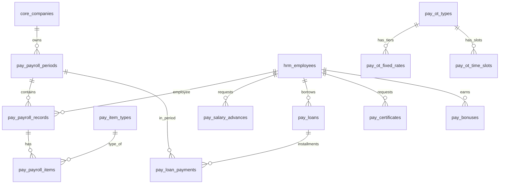

# TSD_03: Payroll Module

# Technical Specification Document

> **Version:** 1.0
> **Status:** ✅ เสร็จ (อ้างอิงจาก Code จริง)
> **Last Updated:** 2026-03-10
> **PRD Reference:** PRD #03 (Payroll System)
> **Dependencies:** TSD_01 (Core Infrastructure), TSD_02 (HRM Module)

---

## 1. ภาพรวมและขอบเขต (Overview & Scope)

### 1.1 สรุป

ระบบเงินเดือนครบวงจร:

- รอบเงินเดือน 21-20 (DRAFT → REVIEWING → FINALIZED → PAID)
- คำนวณ: Base Salary + OT + Earnings - SSF - Tax - Loan - Advance - Deductions
- Configurable OT Engine (3 วิธี: FORMULA, FIXED_RATE, TIME_SLOT)
- Configurable Payroll Items (HR เพิ่มหัวข้อรายได้/หักเองได้)
- กู้ยืมพนักงาน + เบิกเงินเดือนล่วงหน้า (Dual Approval)
- หนังสือรับรอง/เอกสาร (6 ประเภท + Auto Doc Number + ลงนาม)
- โบนัสประจำปี (คะแนนประเมิน 70% + Attendance 30%)

### 1.2 ผู้ใช้งาน

| กลุ่ม     | การเข้าถึง                         |
| :-------- | :--------------------------------- |
| HR        | คำนวณ + ตรวจสอบ + ยืนยัน           |
| ผู้บริหาร | อนุมัติ Payroll + ดูรายงาน         |
| พนักงาน   | ดูสลิป + ขอเบิกล่วงหน้า + ดูกู้ยืม |

---

## 2. Tech Stack & Architecture

### 2.1 Backend Structure

```
backend/pay/
├── index.php              # Router — 8 resources
└── models/
    ├── PayPayroll.php      # Periods, Records, Items, Calculate, Recalculate
    ├── PayLoan.php         # Loans CRUD, Advances CRUD, Dual Approval
    ├── PayCertificate.php  # 6 doc types, sign/approve/reject, auto doc#
    └── PayBonus.php        # Score calc (eval 70% + attend 30%), approve
```

### 2.2 Frontend Structure

```
frontend/src/views/
├── PayPayrollPage.jsx      # 3-tab: รอบเงินเดือน + รายละเอียดรอบ + สลิป
├── PayLoansPage.jsx        # 2-tab: เงินกู้ยืม + เบิกเงินล่วงหน้า
├── PayCertificatesPage.jsx # เอกสาร 6 ประเภท, ขอ/อนุมัติ/ปฏิเสธ
└── PayBonusesPage.jsx      # Dashboard + คะแนน + แก้ไข + อนุมัติ
```

---

## 3. Database Schema (โครงสร้างฐานข้อมูล)

### 3.1 ER Diagram



### 3.2 Table Definitions

> **ที่มา:** อ่านจาก `005_pay_schema.sql` จริง (12 ตาราง)

#### 3.2.1 `pay_ot_types` — Master ประเภท OT

| Column         | Type                                     | Comment                 |
| :------------- | :--------------------------------------- | :---------------------- |
| `id`           | INT PK AI                                | —                       |
| `code`         | VARCHAR(50) UNIQUE                       | เช่น OT_REGULAR_DHL     |
| `name_th`      | VARCHAR(100)                             | ชื่อไทย                 |
| `calc_method`  | ENUM('FORMULA','FIXED_RATE','TIME_SLOT') | วิธีคำนวณ               |
| `formula_base` | ENUM('HOURLY','DAILY')                   | HOURLY=÷30÷8, DAILY=÷30 |
| `multiplier`   | DECIMAL(3,1)                             | ตัวคูณ                  |
| `min_hours`    | DECIMAL(3,1)                             | ชม.ขั้นต่ำ (0=ไม่มี)    |
| `company_id`   | INT FK                                   | NULL=ทุกบริษัท          |
| `branch_id`    | INT FK                                   | NULL=ทุกสาขา            |
| `is_active`    | TINYINT(1)                               | Default: 1              |

#### 3.2.2 `pay_ot_fixed_rates` — Tier อัตรา OT

| Column          | Type          | Comment                     |
| :-------------- | :------------ | :-------------------------- |
| `ot_type_id`    | INT FK        | FK → pay_ot_types (CASCADE) |
| `salary_min`    | DECIMAL(12,2) | เงินเดือนขั้นต่ำ            |
| `salary_max`    | DECIMAL(12,2) | สูงสุด (NULL=ไม่จำกัด)      |
| `rate_per_hour` | DECIMAL(10,2) | บาท/ชม.                     |
| `multiplier`    | DECIMAL(3,1)  | ตัวคูณ                      |

#### 3.2.3 `pay_ot_time_slots` — Shift Premium

| Column       | Type          | Comment                     |
| :----------- | :------------ | :-------------------------- |
| `ot_type_id` | INT FK        | FK → pay_ot_types (CASCADE) |
| `start_time` | TIME          | เวลาเริ่ม                   |
| `end_time`   | TIME          | เวลาสิ้นสุด                 |
| `amount`     | DECIMAL(10,2) | Flat amount ต่อ Segment     |

#### 3.2.4 `pay_item_types` — หัวข้อรายได้/เงินหัก

| Column       | Type                       | Comment                  |
| :----------- | :------------------------- | :----------------------- |
| `id`         | INT PK AI                  | —                        |
| `code`       | VARCHAR(50) UNIQUE         | e.g. BASE_SALARY, OT_PAY |
| `name_th`    | VARCHAR(100)               | —                        |
| `type`       | ENUM('INCOME','DEDUCTION') | รายได้ or เงินหัก        |
| `calc_type`  | ENUM('AUTO','MANUAL')      | ระบบคำนวณ or HR กรอก     |
| `is_system`  | TINYINT(1)                 | 1=ห้ามลบ                 |
| `is_active`  | TINYINT(1)                 | —                        |
| `sort_order` | INT                        | ลำดับในสลิป              |

**System Items (is_system=1, ห้ามลบ):**

| Code            | Name                | Type             |
| :-------------- | :------------------ | :--------------- |
| BASE_SALARY     | เงินเดือนฐาน        | INCOME / AUTO    |
| OT_PAY          | ค่าล่วงเวลา         | INCOME / AUTO    |
| HOLIDAY_WORK    | ค่าทำงานวันหยุด     | INCOME / AUTO    |
| SOCIAL_SECURITY | ประกันสังคม         | DEDUCTION / AUTO |
| WITHHOLDING_TAX | ภาษีหัก ณ ที่จ่าย   | DEDUCTION / AUTO |
| SALARY_ADVANCE  | หักเบิกเงินล่วงหน้า | DEDUCTION / AUTO |
| LOAN_PAYMENT    | หักผ่อนกู้ยืม       | DEDUCTION / AUTO |

#### 3.2.5 `pay_payroll_periods` — รอบเงินเดือน

| Column         | Type                                         | Comment                  |
| :------------- | :------------------------------------------- | :----------------------- |
| `id`           | INT PK AI                                    | —                        |
| `company_id`   | INT FK                                       | FK → core_companies      |
| `period_month` | VARCHAR(7)                                   | YYYY-MM (e.g. "2026-02") |
| `start_date`   | DATE                                         | 21 ของเดือนก่อน          |
| `end_date`     | DATE                                         | 20 ของเดือนนี้           |
| `pay_date`     | DATE                                         | 1 ของเดือนถัดไป          |
| `status`       | ENUM('DRAFT','REVIEWING','FINALIZED','PAID') | —                        |
| `finalized_by` | BIGINT UNSIGNED FK                           | FK → core_users          |
| **UNIQUE**     | `(company_id, period_month)`                 |                          |

#### 3.2.6 `pay_payroll_records` — เงินเดือนรายคน

| Column             | Type                       | Comment                      |
| :----------------- | :------------------------- | :--------------------------- |
| `id`               | INT PK AI                  | —                            |
| `period_id`        | INT FK                     | FK → pay_payroll_periods     |
| `employee_id`      | INT FK                     | FK → hrm_employees           |
| `base_salary`      | DECIMAL(12,2)              | เงินเดือนฐาน ณ รอบนั้น       |
| `working_days`     | INT                        | จำนวนวันทำงาน (DAILY type)   |
| `total_income`     | DECIMAL(12,2)              | รวมรายได้                    |
| `total_deduction`  | DECIMAL(12,2)              | รวมเงินหัก                   |
| `net_pay`          | DECIMAL(12,2)              | เงินสุทธิ                    |
| `tax_auto_amount`  | DECIMAL(12,2)              | ภาษีที่ระบบคำนวณ             |
| `tax_final_amount` | DECIMAL(12,2)              | ภาษีที่ใช้จริง (HR override) |
| **UNIQUE**         | `(period_id, employee_id)` |                              |

#### 3.2.7 `pay_payroll_items` — รายการย่อย

| Column         | Type                        | Comment                            |
| :------------- | :-------------------------- | :--------------------------------- |
| `record_id`    | INT FK                      | FK → pay_payroll_records (CASCADE) |
| `item_type_id` | INT FK                      | FK → pay_item_types                |
| `amount`       | DECIMAL(12,2)               | จำนวนเงิน                          |
| `description`  | VARCHAR(255)                | —                                  |
| **UNIQUE**     | `(record_id, item_type_id)` |                                    |

#### 3.2.8 `pay_salary_advances` — เบิกเงินล่วงหน้า (Dual Approval)

| Column           | Type                                              | Comment          |
| :--------------- | :------------------------------------------------ | :--------------- |
| `id`             | INT PK AI                                         | —                |
| `employee_id`    | INT FK                                            | —                |
| `period_month`   | VARCHAR(7)                                        | รอบเดือนที่เบิก  |
| `amount`         | DECIMAL(12,2)                                     | จำนวนเงิน        |
| `reason`         | TEXT                                              | —                |
| `manager_status` | ENUM('PENDING','APPROVED','REJECTED')             | Approval ระดับ 1 |
| `manager_id`     | BIGINT UNSIGNED FK                                | —                |
| `hr_status`      | ENUM('PENDING','APPROVED','REJECTED')             | Approval ระดับ 2 |
| `hr_id`          | BIGINT UNSIGNED FK                                | —                |
| `overall_status` | ENUM('PENDING','APPROVED','REJECTED','CANCELLED') | สถานะรวม         |

#### 3.2.9 `pay_loans` — เงินกู้ยืม

| Column               | Type                                   | Comment            |
| :------------------- | :------------------------------------- | :----------------- |
| `id`                 | INT PK AI                              | —                  |
| `employee_id`        | INT FK                                 | —                  |
| `loan_amount`        | DECIMAL(12,2)                          | เงินต้น            |
| `has_interest`       | TINYINT(1)                             | 1=มีดอกเบี้ย       |
| `interest_rate`      | DECIMAL(5,2)                           | %/ปี (Flat Rate)   |
| `total_interest`     | DECIMAL(12,2)                          | ดอกเบี้ยรวม        |
| `total_amount`       | DECIMAL(12,2)                          | เงินต้น + ดอกเบี้ย |
| `monthly_payment`    | DECIMAL(12,2)                          | ยอดผ่อน/เดือน      |
| `total_installments` | INT                                    | จำนวนงวด           |
| `paid_installments`  | INT                                    | ผ่อนแล้ว           |
| `remaining_balance`  | DECIMAL(12,2)                          | คงเหลือ            |
| `start_date`         | DATE                                   | เดือนเริ่มหัก      |
| `status`             | ENUM('ACTIVE','COMPLETED','CANCELLED') | —                  |

#### 3.2.10 `pay_loan_payments` — ประวัติผ่อนกู้ยืม

| Column              | Type                   | Comment                  |
| :------------------ | :--------------------- | :----------------------- |
| `loan_id`           | INT FK                 | FK → pay_loans           |
| `period_id`         | INT FK                 | FK → pay_payroll_periods |
| `installment_no`    | INT                    | งวดที่                   |
| `payment_amount`    | DECIMAL(12,2)          | จำนวนเงิน                |
| `remaining_balance` | DECIMAL(12,2)          | ยอดหลังหัก               |
| **UNIQUE**          | `(loan_id, period_id)` |                          |

#### 3.2.11 `pay_certificates` — เอกสาร (6 ประเภท)

| Column            | Type                                                                             | Comment            |
| :---------------- | :------------------------------------------------------------------------------- | :----------------- |
| `id`              | INT PK AI                                                                        | —                  |
| `employee_id`     | INT FK                                                                           | —                  |
| `doc_type`        | ENUM('CERT_WORK','CERT_SALARY','CONTRACT','SUBCONTRACT','RESIGN','DISCIPLINARY') | —                  |
| `document_number` | VARCHAR(50) UNIQUE                                                               | Auto-Generate      |
| `issued_date`     | DATE                                                                             | วันที่ออก          |
| `requested_by`    | BIGINT UNSIGNED FK                                                               | ผู้ขอ              |
| `approver_id`     | BIGINT UNSIGNED FK                                                               | ผู้ยืนยัน          |
| `status`          | ENUM('PENDING_APPROVAL','SIGNED','APPROVED','REJECTED')                          | —                  |
| `sign_method`     | ENUM('UPLOAD_IMAGE','E_SIGNATURE','PRINT_SIGN_UPLOAD','APPROVE_ONLY')            | วิธีลงนาม          |
| `salary_at_issue` | DECIMAL(12,2)                                                                    | เงินเดือน ณ วันออก |

#### 3.2.12 `pay_bonuses` — โบนัสประจำปี

| Column             | Type                            | Comment   |
| :----------------- | :------------------------------ | :-------- |
| `id`               | INT PK AI                       | —         |
| `employee_id`      | INT FK                          | —         |
| `year`             | INT                             | ปี (ค.ศ.) |
| `evaluation_score` | DECIMAL(5,2)                    | เต็ม 70   |
| `attendance_score` | DECIMAL(5,2)                    | เต็ม 30   |
| `total_score`      | DECIMAL(5,2)                    | เต็ม 100  |
| `bonus_amount`     | DECIMAL(12,2)                   | HR กำหนด  |
| `status`           | ENUM('DRAFT','APPROVED','PAID') | —         |
| **UNIQUE**         | `(employee_id, year)`           |           |

---

## 4. API Endpoints (จุดเชื่อมต่อ API)

> ทุก API ใช้ prefix `/api/pay/`, ต้อง Auth (JWT)

### 4.1 Periods (รอบเงินเดือน)

| Method | Path                           | คำอธิบาย                | Required                           |
| :----- | :----------------------------- | :---------------------- | :--------------------------------- |
| `GET`  | `/api/pay/periods`             | รายการรอบ               | `?company_id=*&year=`              |
| `GET`  | `/api/pay/periods/{id}`        | รายละเอียดรอบ + summary | —                                  |
| `POST` | `/api/pay/periods`             | สร้างรอบใหม่            | Body: `{company_id, period_month}` |
| `PUT`  | `/api/pay/periods/{id}/status` | อัปเดตสถานะ             | Body: `{status}`                   |

### 4.2 Records (เงินเดือนรายคน)

| Method | Path                    | คำอธิบาย                | Required               |
| :----- | :---------------------- | :---------------------- | :--------------------- |
| `GET`  | `/api/pay/records`      | รายการเงินเดือนรายคน    | `?period_id=*&search=` |
| `GET`  | `/api/pay/records/{id}` | รายละเอียด 1 คน + items | —                      |

### 4.3 Calculate (คำนวณ)

| Method | Path                 | คำอธิบาย     | Required            |
| :----- | :------------------- | :----------- | :------------------ |
| `POST` | `/api/pay/calculate` | คำนวณทั้งรอบ | Body: `{period_id}` |

**Response:**

```json
{
  "message": "คำนวณเงินเดือนสำเร็จ",
  "count": 5,
  "results": [
    {
      "employee_code": "SDR001",
      "name": "สมชาย วงศ์ศรี",
      "base_salary": 45000,
      "total_income": 46500,
      "total_deduction": 3177.18,
      "net_pay": 43322.82
    }
  ]
}
```

### 4.4 Items (ปรับรายการ)

| Method   | Path                  | คำอธิบาย       | Required                                                |
| :------- | :-------------------- | :------------- | :------------------------------------------------------ |
| `POST`   | `/api/pay/items`      | เพิ่ม/แก้ item | Body: `{record_id, item_type_id, amount, description?}` |
| `DELETE` | `/api/pay/items/{id}` | ลบ item        | —                                                       |

> ✅ หลังแก้ item → `recalculateTotals()` อัตโนมัติ

### 4.5 Item Types (หัวข้อ Config)

| Method   | Path                       | คำอธิบาย                |
| :------- | :------------------------- | :---------------------- |
| `GET`    | `/api/pay/item-types`      | รายการหัวข้อทั้งหมด     |
| `POST`   | `/api/pay/item-types`      | สร้างหัวข้อ             |
| `PUT`    | `/api/pay/item-types/{id}` | แก้ไข                   |
| `DELETE` | `/api/pay/item-types/{id}` | ลบ (ห้ามลบ is_system=1) |

### 4.6 Advances (เบิกเงินล่วงหน้า)

| Method | Path                                | คำอธิบาย       | Required                                            |
| :----- | :---------------------------------- | :------------- | :-------------------------------------------------- | -------------------------- | --------- |
| `GET`  | `/api/pay/advances`                 | รายการเบิก     | `?company_id=&employee_id=&period_month=&status=`   |
| `GET`  | `/api/pay/advances/{empId}/ceiling` | เพดานเบิก      | `?period_month=`                                    |
| `POST` | `/api/pay/advances`                 | ยื่นคำขอ       | Body: `{employee_id, period_month, amount, reason}` |
| `PUT`  | `/api/pay/advances/{id}/approve`    | อนุมัติ/ปฏิเสธ | Body: `{role: "hr                                   | manager", action: "approve | reject"}` |

### 4.7 Loans (กู้ยืม)

| Method | Path                  | คำอธิบาย                        | Required                            |
| :----- | :-------------------- | :------------------------------ | :---------------------------------- |
| `GET`  | `/api/pay/loans`      | รายการกู้ยืม                    | `?company_id=&employee_id=&status=` |
| `GET`  | `/api/pay/loans/{id}` | รายละเอียด + payments           | —                                   |
| `POST` | `/api/pay/loans`      | สร้างกู้ยืม                     | Body (ดูด้านล่าง)                   |
| `PUT`  | `/api/pay/loans/{id}` | Cancel: `{status: "CANCELLED"}` | —                                   |

**Create Loan Body:**

```json
{
  "employee_id": 2,
  "loan_amount": 50000,
  "has_interest": 0,
  "monthly_payment": 5000,
  "total_installments": 10,
  "start_date": "2026-04-01"
}
```

### 4.8 Certificates (เอกสาร)

| Method | Path                                | คำอธิบาย     | Required                                      |
| :----- | :---------------------------------- | :----------- | :-------------------------------------------- |
| `GET`  | `/api/pay/certificates`             | รายการเอกสาร | `?company_id=&employee_id=&doc_type=&status=` |
| `GET`  | `/api/pay/certificates/{id}`        | รายละเอียด   | —                                             |
| `POST` | `/api/pay/certificates`             | สร้างเอกสาร  | Body: `{employee_id, doc_type, issued_date}`  |
| `PUT`  | `/api/pay/certificates/{id}/sign`   | ลงนาม        | Body: `{sign_method, signature_image_path?}`  |
| `PUT`  | `/api/pay/certificates/{id}/reject` | ปฏิเสธ       | Body: `{reason}`                              |

### 4.9 Bonuses (โบนัส)

| Method | Path                         | คำอธิบาย             | Required                        |
| :----- | :--------------------------- | :------------------- | :------------------------------ |
| `GET`  | `/api/pay/bonuses`           | รายการโบนัส          | `?year=&company_id=`            |
| `POST` | `/api/pay/bonuses/calculate` | คำนวณคะแนน           | Body: `{year, company_id}`      |
| `PUT`  | `/api/pay/bonuses/{id}`      | แก้ไขจำนวนเงิน/notes | Body: `{bonus_amount?, notes?}` |
| `POST` | `/api/pay/bonuses/approve`   | อนุมัติทั้งหมด       | Body: `{year, company_id}`      |

### 4.10 OT Types (Config)

| Method | Path                | คำอธิบาย                         |
| :----- | :------------------ | :------------------------------- |
| `GET`  | `/api/pay/ot-types` | รายการ OT types (`?company_id=`) |

---

## 5. Business Logic & Rules

### 5.1 Payroll Cycle (21-20)

```
สร้างรอบเดือน "2026-02":
  start_date = 2026-01-21
  end_date   = 2026-02-20
  pay_date   = 2026-03-01

Status Flow:
  DRAFT → REVIEWING → FINALIZED → PAID
  (ทุกขั้นเปลี่ยนผ่าน PUT /periods/{id}/status)
```

### 5.2 Salary Calculation Formula

```
Net Pay = Base Salary
        + OT Pay (Auto-calculated)
        + Holiday Work Pay (Auto)
        + Other Manual Earnings (MEETING_FEE, ALLOWANCE, etc.)
        - Social Security (Auto)
        - Withholding Tax (Auto)
        - Salary Advance (Auto)
        - Loan Payment (Auto)
        - Other Manual Deductions (DORM_FEE, etc.)
```

### 5.3 OT Calculation (3 Methods)

#### FORMULA (ใช้กับ DHL: SXD, SPD)

```
OT Pay = (base_salary ÷ 30 ÷ 8) × multiplier × hours
  - formula_base = HOURLY → ÷30 ÷8
  - formula_base = DAILY  → ÷30

ตัวอย่าง: base=45000, OT 1.5x, 2 ชม.
= (45000 ÷ 30 ÷ 8) × 1.5 × 2 = 562.50 บาท
```

#### FIXED_RATE (ใช้กับ CarRental: SDR, SAR)

```
OT Pay = rate_per_hour × multiplier × hours
  - rate ดูจาก pay_ot_fixed_rates ตาม salary tier

Tiers ตัวอย่าง (SDR):
  salary < 20,000  → rate = 70 บาท/ชม.
  salary ≥ 20,000  → rate = 90 บาท/ชม.

ตัวอย่าง: salary=25000, OT Office วันธรรมดา, 3 ชม.
= 90 × 1.0 × 3 = 270 บาท
```

#### TIME_SLOT (ใช้กับ CNX Shift Premium)

```
ดูตาราง pay_ot_time_slots → Flat amount ต่อช่วง

เวลา           | Amount
17:01 - 19:59  | 100 บาท
20:00 - 22:00  | 200 บาท
22:01 - 23:59  | 300 บาท
00:00 - 01:59  | 500 บาท
02:00 - 03:59  | 600 บาท
04:00 - 05:00  | 300 บาท
05:01 - 06:00  | 200 บาท
06:01 - 07:59  | 100 บาท
```

### 5.4 Social Security

```
Employee = base_salary × 5% (cap ที่ 750 บาท)
Salary cap = 15,000 บาท
→ ถ้า base > 15000 → SSF = 750

Config: SOCIAL_SECURITY_RATE, SOCIAL_SECURITY_MAX_SALARY
(จาก core_system_config)
```

### 5.5 Advance Dual Approval

```
พนักงานยื่นเบิก → manager_status = PENDING
  → หัวหน้าอนุมัติ → manager_status = APPROVED
    → HR อนุมัติ → hr_status = APPROVED → overall_status = APPROVED
  → ปฏิเสธที่ขั้นไหน → overall_status = REJECTED

เพดานเบิก = base_salary × ADVANCE_CEILING_RATIO (default: 30%)
```

### 5.6 Bonus Score Calculation

```
Total Score (100) = Evaluation Score (70) + Attendance Score (30)

Evaluation Score (70):
  = (average weighted_score from hrm_evaluations for year) ÷ 5 × 70
  ถ้าไม่มีผลประเมิน → 0

Attendance Score (30):
  = 30 - (late_count × 0.5)
  late_count = จำนวนวันที่ scan_time > shift.start_time ในปีนั้น
  floor: min = 0
```

### 5.7 Certificate Auto Doc Number

```
Format: [PREFIX]-[YYMM]-[SEQUENCE]
Example: CERT-2603-00001

PREFIX ตาม doc_type:
  CERT_WORK    → CERT
  CERT_SALARY  → CERT
  CONTRACT     → CONT
  SUBCONTRACT  → SUBC
  RESIGN       → RESG
  DISCIPLINARY → DISC
```

---

## 6. Security & Constraints

- **Auth:** ทุก API ต้องผ่าน `requireAuth()` (JWT)
- **System Items:** `pay_item_types` ที่ `is_system=1` ห้ามลบ
- **Recalculate:** หลัง UPSERT/DELETE item → `recalculateTotals()` อัตโนมัติ
- **Period Lock:** เปลี่ยนสถานะเป็น FINALIZED/PAID แล้ว ไม่ควรแก้ item (⚠️ ยังไม่มี guard)
- **Loan Cancel:** `cancelLoan()` เปลี่ยน status เป็น CANCELLED

---

## 7. Dependencies & Integration Points

### ใช้จาก TSD_01

| Dependency         | สิ่งที่ใช้                                   |
| :----------------- | :------------------------------------------- |
| AuthMiddleware     | ตรวจ JWT ทุก API                             |
| BaseModel          | Shared CRUD methods                          |
| core_users         | `user->sub` สำหรับ finalized_by, approved_by |
| core_companies     | JOIN ข้อมูลบริษัท                            |
| core_system_config | SOCIAL_SECURITY_RATE, SSF_MAX                |

### ใช้จาก TSD_02

| Data                           | สิ่งที่ใช้                                              |
| :----------------------------- | :------------------------------------------------------ |
| hrm_employees                  | base_salary, salary_type, company_id, branch_id, status |
| hrm_ot_requests (APPROVED)     | ชั่วโมง OT + `ot_type` enum                             |
| hrm_leave_requests (is_paid=0) | วันลาไม่รับค่าจ้าง → หักเงิน                            |
| hrm_time_logs                  | วันทำงาน (DAILY type), late count (bonus)               |
| hrm_evaluations                | weighted_score สำหรับโบนัส                              |

---

## 8. Schema Mismatches (สำคัญ!)

> สิ่งที่ TSD/Code เดิมคาดว่ามี แต่ DB จริงไม่ตรง — **Code ถูกแก้แล้ว**

| สิ่งที่คาดใน Code เดิม            | DB จริง                          | แก้ไข                                          |
| :-------------------------------- | :------------------------------- | :--------------------------------------------- |
| `hrm_employees.department_id`     | ❌ ไม่มี                         | ลบ dept JOIN ออกจาก getRecords + getBonus      |
| `hrm_ot_requests.ot_type_id`      | ใช้ `ot_type` ENUM               | เขียน OT calc ใช้ enum ตรงๆ                    |
| `e.status = 'ACTIVE'`             | ใช้ FULL_TIME/PROBATION/CONTRACT | เปลี่ยนเป็น `NOT IN ('RESIGNED','TERMINATED')` |
| `hrm_evaluations.evaluation_date` | ใช้ `evaluation_month`           | แก้ query                                      |
| `hrm_time_logs.status`            | ❌ ไม่มี                         | คำนวณ late จาก raw scan_time vs shift          |
| `hrm_time_logs.late_minutes`      | ❌ ไม่มี                         | คำนวณจาก scan_time - start_time                |
| `core_level_permissions.can_view` | ❌ มีแค่ level_id+app_id         | ลบ check                                       |
| Period status `APPROVED`          | ใช้ `FINALIZED`                  | แก้ status flow                                |

---

## 9. Open Questions

| #   | คำถาม                                             | สถานะ |
| :-- | :------------------------------------------------ | :---- |
| 1   | Payslip PDF Template Design — ใช้ layout แบบไหน?  | ⏳    |
| 2   | Certificate PDF Template Design                   | ⏳    |
| 3   | Tax Calculation Rules — ใช้ตารางภาษีจริง?         | ⏳    |
| 4   | Excel Export Format — columns?                    | ⏳    |
| 5   | Period status guard — lock items after FINALIZED? | ⏳    |
| 6   | Advance ceiling ratio — ค่า default เท่าไหร่?     | ⏳    |
