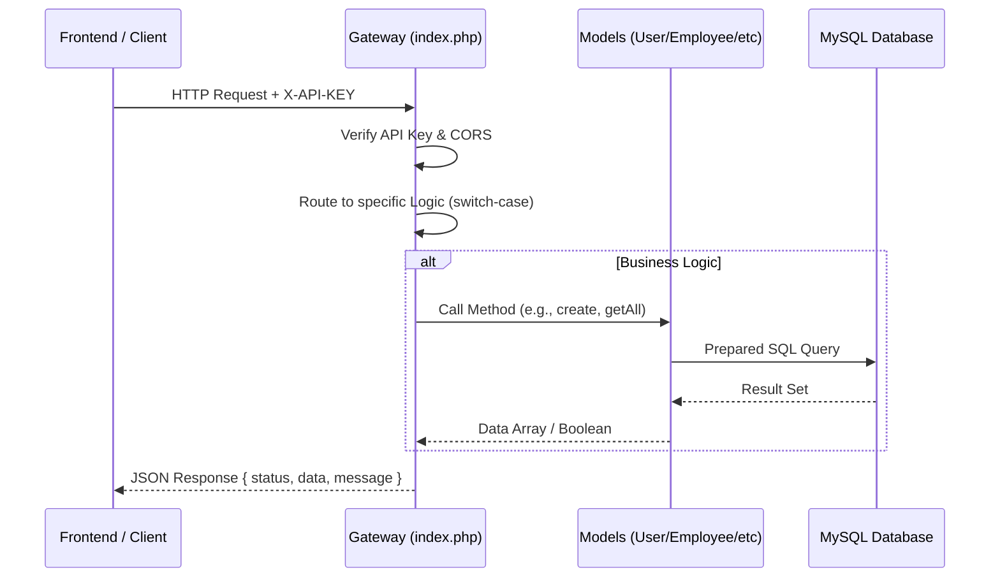

# เอกสารอธิบายระบบ Backend (SiamGroup V3)

## 1. ภาพรวมระบบ (Overview)

ระบบ Backend ของ SiamGroup V3 พัฒนาขึ้นเพื่อรองรับการบริหารจัดการทรัพยากรบุคคล (HRM) แบบครบวงจร โดยเน้นความเรียบง่าย รวดเร็ว และปลอดภัย สถาปัตยกรรมเป็นแบบ **Model-Based Architecture** โดยใช้ **Pure PHP** (ไม่มี Framework) เชื่อมต่อกับฐานข้อมูล MySQL ผ่าน PDO

ระบบทำหน้าที่เป็น **Centralized API Gateway** ให้กับ Frontend (Web/Mobile) รองรับฟังก์ชันหลัก:

- การจัดการพนักงาน (Employee Management)
- การลงเวลาเข้า-ออกงาน (Time Attendance)
- การจัดการระบบลา (Leave Management)
- การจัดการล่วงเวลา (OT Management)
- การแก้ไขเวลาและสลับกะ (Time Correction & Shift Swap)

## 2. มาตรการความปลอดภัย (Security Layers) 🔐

ระบบใช้มาตรการความปลอดภัยหลายระดับใน `index.php`:

1.  **API Key Authentication:**
    - ทุก Request **ต้อง** แนบ Header `X-API-KEY` ที่ตรงกับค่า `API_SECRET_KEY` ในไฟล์ `.env`
    - หากคีย์ไม่ถูกต้อง ระบบจะปฏิเสธด้วย `401 Unauthorized` ทันที

2.  **CORS Policy (Cross-Origin Resource Sharing):**
    - อนุญาตเฉพาะ Origin, Method และ Header ที่กำหนด
    - รองรับ `OPTIONS` preflight request สำหรับเบราว์เซอร์สมัยใหม่

3.  **Data Security:**
    - **Password Hashing:** รหัสผ่านผู้ใช้ถูกเข้ารหัสด้วย `BCRYPT` (`password_hash`)
    - **SQL Injection Prevention:** ใช้ **PDO Prepared Statements** ในการ Query ฐานข้อมูลทุกจุด
    - **Input Validation:** ตรวจสอบข้อมูลขาเข้าก่อนนำไปประมวลผล

## 3. โครงสร้างไฟล์ (Directory Structure)

```text
backend_v3/
├── .env                        # การตั้งค่าระบบ (Database, Secrets)
├── index.php                   # API Gateway (Router & Controller)
├── config/
│   └── config.php              # การเชื่อมต่อฐานข้อมูล & Load Environment
├── models/
│   ├── BaseModel.php           # แม่แบบ Model (CRUD Wrapper)
│   ├── User.php                # จัดการผู้ใช้ & Login
│   ├── Employee.php            # ข้อมูลพนักงาน
│   ├── TimeLog.php             # บันทึกเวลา
│   ├── LeaveRequest.php        # ขอลา & อนุมัติ
│   ├── OtRequest.php           # ขอ OT & อนุมัติ
│   └── ... (อื่นๆ เช่น Company, Branch, Holiday)
└── scripts/                    # Scripts สำหรับ Admin/Dev
    ├── seed_data.php           # สคริปต์สร้างข้อมูลจำลอง (Seeding)
    └── test_full_flow.php      # สคริปต์ทดสอบระบบเต็มรูปแบบ (End-to-End Test)
```

## 4. สถาปัตยกรรมและกระแสข้อมูล (Architecture Flow)



## 5. องค์ประกอบหลัก (Key Components)

### 5.1. API Gateway (`index.php`)

จุดเข้าใช้งานจุดเดียว (Single Entry Point) ทำหน้าที่:

- โหลด Config และ Models
- ตรวจสอบความปลอดภัย (Auth & Headers)
- Routing Request ตาม Query Parameter `endpoint`
- คืนค่าเป็น JSON Standard Format

### 5.2. Models (`models/`)

จัดการ Logic ของข้อมูลและฐานข้อมูล:

- **BaseModel:** ให้ฟังก์ชันมาตรฐาน `create()`, `update()`, `delete()`, `find()`, `getAll()`
- **Business Models:** (เช่น `Employee`, `LeaveRequest`) สืบทอดจาก BaseModel และเพิ่ม Logic เฉพาะทาง

### 5.3. Configuration Strategy

ใช้ไฟล์ `.env` ในการเก็บความลับ (Credentials) และ `config.php` ในการโหลดเข้าสู่ระบบ ทำให้ง่ายต่อการ Deploy ในสภาพแวดล้อมที่ต่างกัน (Local vs Production)
