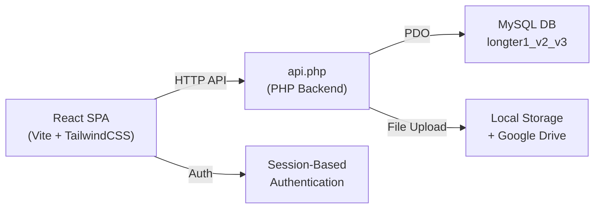
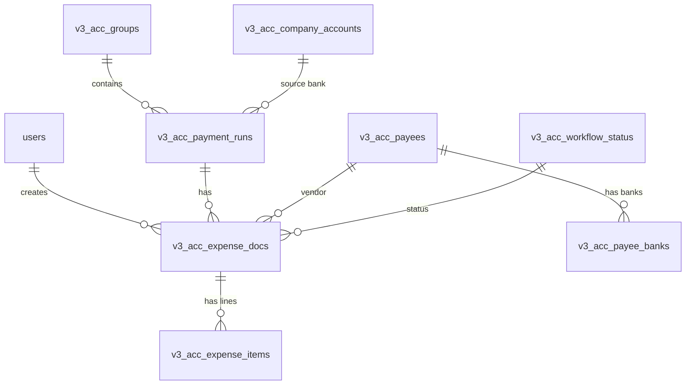
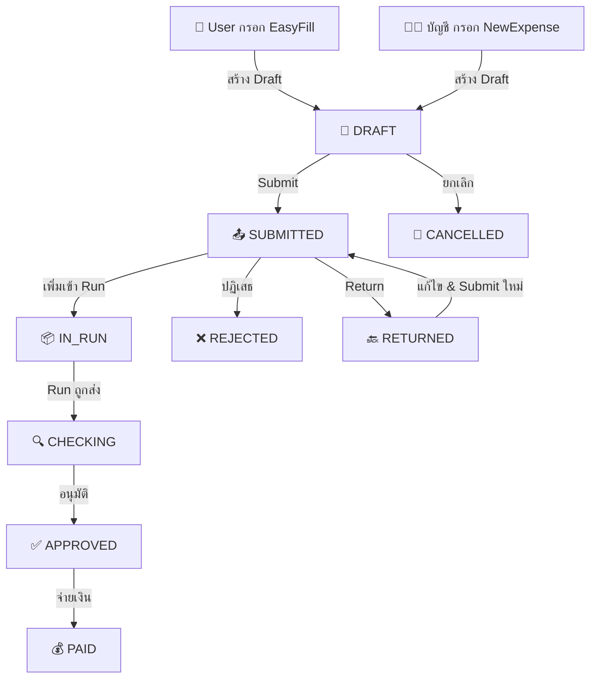
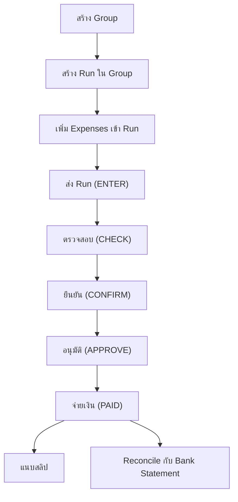

# 📊 สรุปการทำงานระบบ ACC (Accounting System)

**สถานะ:** Active Production
**วันที่สรุป:** 2026-03-05

---

## 1. ภาพรวมระบบ (System Overview)

ระบบ ACC เป็น **ระบบบริหารจัดการค่าใช้จ่าย** (Expense Management System) สำหรับองค์กรขนาดกลาง-ใหญ่ ที่รองรับหลายบริษัท (Multi-Company) และหลายสาขา (Multi-Branch) โดยมี Workflow การอนุมัติที่ยืดหยุ่น

### เทคโนโลยีที่ใช้

| Layer            | Technology                 | Path                                      |
| ---------------- | -------------------------- | ----------------------------------------- |
| **Frontend**     | React + Vite + TailwindCSS | `C:\xampp\htdocs\acc\src`                 |
| **Backend**      | PHP (Single API file)      | `C:\xampp\htdocs\v2\acc\back_end\api.php` |
| **Database**     | MySQL (via PDO)            | Database: `longter1_v2_v3`                |
| **Config**       | PHP DB Config              | `C:\xampp\htdocs\v2\db.php`               |
| **File Storage** | Local + Google Drive       | `back_end/uploads/` + GDrive              |

### สถาปัตยกรรม



### API URL Pattern

- **Local:** `http://localhost/v2/acc/back_end/api.php?action=<ACTION>`
- **Staging:** `http://147.50.254.111/acc/back_end/api.php?action=<ACTION>`
- **Production:** `{origin}/v2/acc/back_end/api.php?action=<ACTION>`

---

## 2. ฐานข้อมูล (Database Schema)

> [!NOTE]
> ตาราง prefix `v3_acc_` หมายถึงตารางใหม่ของ Module การเงิน V3.2

### ตารางหลัก (Core Tables)



### รายละเอียดตาราง

| ตาราง                       | หน้าที่                     | คอลัมน์สำคัญ                                                                                  |
| --------------------------- | --------------------------- | --------------------------------------------------------------------------------------------- |
| `v3_acc_groups`             | จัดกลุ่มรอบจ่ายตามวันที่    | `id`, `name`, `group_date`, `group_off`                                                       |
| `v3_acc_payment_runs`       | รอบจ่ายเงิน (Batch Payment) | `id`, `run_code`, `group_id`, `source_bank_id`, `total_amount`, `status`                      |
| `v3_acc_expense_docs`       | เอกสารค่าใช้จ่าย (Header)   | `id`, `doc_id`, `expense_type`, `status_id`, `payee_id`, `run_id`                             |
| `v3_acc_expense_items`      | รายการย่อย (Lines)          | `id`, `doc_id`, `category_id`, `amount_before_vat`, `vat_amount`, `wht_amount`, `net_payment` |
| `v3_acc_payees`             | ทะเบียนคู่ค้า / พนักงาน     | `id`, `name`, `type` (INTERNAL/EXTERNAL), `tax_id`, `company_id`                              |
| `v3_acc_payee_banks`        | บัญชีธนาคารของคู่ค้า        | `id`, `payee_id`, `bank_name`, `account_number`, `account_name`                               |
| `v3_acc_workflow_status`    | สถานะ Master Data           | `id`, `name`, `label_en`                                                                      |
| `v3_acc_approval_rules`     | กฎการอนุมัติ                | `id`, `role_id`, `action_name`, `company_id`, `branch_id`, `min_amount`, `max_amount`         |
| `v3_acc_company_accounts`   | บัญชีธนาคารบริษัท (ต้นทาง)  | `id`, `company_id`, `bank_name`, `account_number`, `nickname`                                 |
| `v3_acc_expense_categories` | หมวดหมู่ค่าใช้จ่าย          | `id`, `gl_code`, `name`                                                                       |
| `users`                     | ผู้ใช้งาน (Core)            | `id`, `name`, `role_id`, `branch_id`                                                          |
| `roles`                     | ตำแหน่ง                     | `id`, `name`                                                                                  |
| `our_companies`             | บริษัท                      | `id`, `name_th`                                                                               |
| `branches`                  | สาขา                        | `id`, `name`, `code`, `company_id`                                                            |

### ประเภทค่าใช้จ่าย (Expense Types)

| Type       | คำอธิบาย                    |
| ---------- | --------------------------- |
| `GENERAL`  | ค่าใช้จ่ายทั่วไป            |
| `PCASH`    | เบิกเงินสดย่อย (Petty Cash) |
| `FCASH`    | จ่ายด่วน (Fast Cash)        |
| `AUTO`     | ค่าใช้จ่ายอัตโนมัติ         |
| `CLAIM`    | เบิกค่าเดินทาง/อื่นๆ        |
| `TRANSFER` | โอนเงินระหว่างบัญชี         |
| `FREFUND`  | คืนเงิน FCASH               |

---

## 3. Backend API (api.php)

> [!IMPORTANT]
> Backend เป็นไฟล์ PHP เดียว (`api.php`, ~4,148 บรรทัด) ใช้ **switch/case** แยก action ประมาณ **98 functions**

### กลุ่ม API ที่สำคัญ

#### 🔐 Authentication & User

| Action             | Method | หน้าที่                               |
| ------------------ | ------ | ------------------------------------- |
| `login`            | POST   | เข้าสู่ระบบ (Session-based)           |
| `logout`           | GET    | ออกจากระบบ                            |
| `get_current_user` | GET    | ดึงข้อมูล User ปัจจุบัน + permissions |
| `get_user`         | GET    | ดึงข้อมูล User (ไม่มี flag data)      |

#### 📄 Expense Management

| Action                      | Method | หน้าที่                                               |
| --------------------------- | ------ | ----------------------------------------------------- |
| `create_expense`            | POST   | สร้างเอกสารค่าใช้จ่ายใหม่ (พร้อม items + attachments) |
| `update_expense`            | POST   | แก้ไขเอกสารค่าใช้จ่าย                                 |
| `get_expense_detail`        | GET    | ดึงรายละเอียดเอกสาร (Header + Items + Attachments)    |
| `get_expenses`              | GET    | ดึงรายการค่าใช้จ่าย (filter by status, date range)    |
| `delete_expense`            | POST   | ลบเอกสารค่าใช้จ่าย                                    |
| `check_duplicate_item`      | GET    | ตรวจสอบรายการซ้ำ                                      |
| `get_expenses_by_ref`       | GET    | ค้นหาด้วย External Reference                          |
| `update_expense_remark`     | POST   | แก้ไขหมายเหตุ                                         |
| `update_expense_tax_info`   | POST   | แก้ไขข้อมูลภาษี                                       |
| `upload_expense_attachment` | POST   | อัพโหลดไฟล์แนบ                                        |

#### 💰 Payment Run & Group

| Action                        | Method | หน้าที่                                   |
| ----------------------------- | ------ | ----------------------------------------- |
| `create_payment_run`          | POST   | สร้างรอบจ่ายใหม่                          |
| `get_payment_runs`            | GET    | ดึงรายการรอบจ่ายทั้งหมด                   |
| `get_payment_run_detail`      | GET    | ดึงรายละเอียดรอบจ่าย                      |
| `add_expenses_to_run`         | POST   | เพิ่มค่าใช้จ่ายเข้ารอบจ่าย                |
| `remove_expense_from_run`     | POST   | นำค่าใช้จ่ายออกจากรอบจ่าย                 |
| `delete_payment_run`          | POST   | ลบรอบจ่าย                                 |
| `update_payment_run`          | POST   | แก้ไขรอบจ่าย                              |
| `create_group`                | POST   | สร้างกลุ่มใหม่                            |
| `get_group_dashboard_data`    | GET    | ดึงข้อมูล Dashboard กลุ่ม (มี Pagination) |
| `get_group_detail`            | GET    | ดึงรายละเอียดกลุ่ม                        |
| `delete_group`                | POST   | ลบกลุ่ม                                   |
| `toggle_group_status`         | POST   | เปิด/ปิดกลุ่ม                             |
| `upload_payment_confirmation` | POST   | อัพโหลดสลิปจ่ายเงิน                       |

#### ✅ Approval & Workflow

| Action                         | Method | หน้าที่                                                    |
| ------------------------------ | ------ | ---------------------------------------------------------- |
| `process_approval`             | POST   | ดำเนินการอนุมัติ (SUBMIT, APPROVE, REJECT, CANCEL, RETURN) |
| `process_payment_run_approval` | POST   | อนุมัติรอบจ่าย (ENTER, CHECK, CONFIRM, APPROVE, PAID)      |
| `get_approval_rules`           | GET    | ดึงกฎการอนุมัติทั้งหมด                                     |
| `update_approval_rule`         | POST   | แก้ไขกฎการอนุมัติ                                          |

#### ⚙️ Settings & Setup

| Action                     | Method | หน้าที่                                                                           |
| -------------------------- | ------ | --------------------------------------------------------------------------------- |
| `get_setup_data`           | GET    | ดึงข้อมูลตั้งค่าทั้งหมด (บริษัท, สาขา, คู่ค้า, mappings, banks, roles, workflows) |
| `update_company_account`   | POST   | แก้ไขบัญชีบริษัท                                                                  |
| `update_payee`             | POST   | แก้ไขข้อมูลคู่ค้า                                                                 |
| `update_payee_bank`        | POST   | แก้ไขบัญชีธนาคารคู่ค้า                                                            |
| `update_expense_mapping`   | POST   | แก้ไข mapping หมวดหมู่                                                            |
| `get_user_access_settings` | GET    | ดึงข้อมูลสิทธิ์ User                                                              |
| `update_user_access`       | POST   | แก้ไขสิทธิ์ User                                                                  |
| `get_module_access_data`   | GET    | ดึงข้อมูลสิทธิ์ Module                                                            |
| `update_module_access`     | POST   | แก้ไขสิทธิ์ Module                                                                |
| `import_payees_from_peak`  | POST   | นำเข้าคู่ค้าจาก Peak                                                              |

#### 🏦 Bank Reconciliation

| Action                       | Method | หน้าที่                   |
| ---------------------------- | ------ | ------------------------- |
| `import_bank_statement`      | POST   | นำเข้า Bank Statement     |
| `get_bank_statements`        | GET    | ดึง Bank Statement        |
| `reconcile_runs`             | POST   | จับคู่รายการ (Reconcile)  |
| `unreconcile_run`            | POST   | ยกเลิกการจับคู่           |
| `get_reconciliation_history` | GET    | ดึงประวัติ Reconciliation |

#### 💵 FCASH Specific

| Action                       | Method | หน้าที่                       |
| ---------------------------- | ------ | ----------------------------- |
| `get_fcash_items_for_refund` | GET    | ดึงรายการ FCASH สำหรับคืนเงิน |
| `create_fcash_refund`        | POST   | สร้างรายการคืนเงิน FCASH      |
| `create_draft_refunds`       | POST   | สร้างร่างรายการคืนเงิน (Bulk) |
| `get_fcash_information`      | GET    | ดึงข้อมูล FCASH Information   |

---

## 4. Frontend - รายละเอียดแต่ละหน้า

### 4.1 🟢 EasyFill.jsx (816 บรรทัด)

**Route:** `/` (หน้าแรก), `/easy-fill`
**หน้าที่:** ฟอร์มกรอกค่าใช้จ่ายแบบอย่างง่าย สำหรับ User ทั่วไป

```carousel
**ฟีเจอร์หลัก:**
- กรอกข้อมูลเบื้องต้นเพื่อสร้าง Expense ในสถานะ **DRAFT**
- รองรับ 3 ประเภท: GENERAL, FCASH, PCASH (ตาม Permission)
- Auto-complete ชื่อคู่ค้า จาก `v3_acc_payees`
- คำนวณ VAT (Excl/Incl/No VAT) + WHT อัตโนมัติ
- แนบรูปภาพ/เอกสาร (ถ่ายรูป หรือ เลือกไฟล์)
- รองรับหลายรายการ (Multi-line items)
- จำข้อมูลธนาคารและสาขาใน `localStorage`
- สามารถ Toggle "รอวางบิล (Wait Bill)" ได้
<!-- slide -->
**API ที่ใช้:**
- `get_setup_data` — โหลด branches, payees, banks, expenseMappings
- `get_expense_detail` — โหลดข้อมูลเมื่อแก้ไข (มี `?id=`)
- `create_expense` / `update_expense` — บันทึก/แก้ไข
- `update_payee_bank` — อัปเดตบัญชีธนาคารคู่ค้าอัตโนมัติ

**DB Tables ที่เกี่ยว:**
- `v3_acc_expense_docs` + `v3_acc_expense_items` — สร้างเอกสาร
- `v3_acc_payees` + `v3_acc_payee_banks` — ข้อมูลคู่ค้า
- `branches`, `our_companies` — สาขาและบริษัท
```

---

### 4.2 📝 NewExpense.jsx (3,060 บรรทัด)

**Route:** `/new-expense`, `/edit-expense/:id`
**หน้าที่:** ฟอร์มสร้าง/แก้ไขค่าใช้จ่ายแบบเต็ม (สำหรับฝ่ายบัญชี)

```carousel
**ฟีเจอร์หลัก:**
- ฟอร์มเต็มรูปแบบ รองรับทุก Expense Type (GENERAL, FCASH, PCASH, AUTO, CLAIM, TRANSFER)
- **Payee Autocomplete** — ค้นหาคู่ค้า (EXTERNAL) พร้อมเลือกบัญชีธนาคาร
- **Holder** — สำหรับ FCASH/PCASH ระบุผู้รับเงิน (INTERNAL) แยกจากคู่ค้า
- **Category Autocomplete** — เลือกหมวดหมู่บัญชี (GL Code)
- **Expense Item Card** — แต่ละ line item มี: จำนวน, ราคา/หน่วย, ประเภทภาษี (Excl/Incl/No VAT), WHT, ข้อมูลใบกำกับ
- **Duplicate Detection** — ตรวจสอบรายการซ้ำ (ตาม Ref, amount)
- **Run Modal** — หลังสร้าง Expense สามารถเลือกใส่ Run ได้ทันที (New Run / Existing Run / New Group)
- **Draft Auto-Save** — บันทึกร่างลง `localStorage` อัตโนมัติ
- **Duplicate Mode** — สร้างรายการซ้ำจากเอกสารเดิม (`?duplicate=`)
- **Vendor Direct Toggle** — โอนตรงให้คู่ค้า (ไม่ผ่าน Holder)
<!-- slide -->
**API ที่ใช้:**
- `get_setup_data` — โหลด branches, payees, banks, expenseMappings, companyAccounts
- `get_expense_detail` — โหลดข้อมูลเมื่อแก้ไข หรือ Duplicate
- `create_expense` / `update_expense` — บันทึก/แก้ไข
- `search_payees` — ค้นหาคู่ค้า
- `get_payee_banks` — ดึงบัญชีธนาคาร
- `update_payee` / `update_payee_bank` — สร้าง/แก้ไขคู่ค้า
- `get_payment_runs` / `get_available_groups` — สำหรับ Run Modal
- `create_payment_run` / `add_expenses_to_run` — สร้าง/เพิ่มเข้า Run
- `check_duplicate_item` — ตรวจสอบซ้ำ
- `get_expenses_by_ref` — ตรวจสอบ Ref ซ้ำ

**DB Tables ที่เกี่ยว:**
- `v3_acc_expense_docs` + `v3_acc_expense_items` — เอกสาร
- `v3_acc_payees` + `v3_acc_payee_banks` — คู่ค้า
- `v3_acc_payment_runs` + `v3_acc_groups` — รอบจ่าย
- `v3_acc_expense_categories` — หมวดหมู่ GL
```

---

### 4.3 📋 ExpenseDashboard.jsx (1,106 บรรทัด)

**Route:** `/expense-dashboard`
**หน้าที่:** แดชบอร์ดจัดการค่าใช้จ่าย (มุมมองฝ่ายบัญชี)

```carousel
**ฟีเจอร์หลัก:**
- **6 แท็บหลัก:**
  1. `DRAFT` — รายการร่าง
  2. `REJECT` — รายการถูกปฏิเสธ / ยกเลิก
  3. `RETURN` — รายการรอแก้ไข
  4. `TO_RUN` — รายการพร้อมเข้ารอบจ่าย (SUBMITTED + ยังไม่มี run)
  5. `RUN` — รอบจ่ายรอส่งตรวจสอบ
  6. `FCASH_REPAY` — รายการ FCASH ที่จ่ายแล้ว รอคืนเงิน

- **Multi-Select + Batch Actions:**
  - เลือกหลายรายการ → เพิ่มเข้า Run พร้อมกัน
  - ตรวจสอบความสอดคล้อง (Bank, Branch, Type เดียวกัน)
  - Bulk Re-Run สำหรับ FCASH

- **Run Modal:**
  - เพิ่มเข้า Run ที่มีอยู่แล้ว
  - สร้าง Run ใหม่ + Group ที่มีอยู่
  - สร้าง Run ใหม่ + Group ใหม่

- **Filters:** ช่วงวันที่, ประเภท, บริษัท, สาขา, ค้นหาข้อความ
- **Actions:** VIEW, EDIT, SUBMIT, CANCEL, RETURN, DELETE
<!-- slide -->
**API ที่ใช้:**
- `get_expenses` (status=ALL) — ดึง Expense ทั้งหมด
- `get_payment_runs` — ดึงรอบจ่าย
- `get_setup_data` — ดึงข้อมูลบริษัท สาขา บัญชี
- `get_available_groups` — ดึง Group ที่เปิดอยู่
- `get_approval_rules` — ดึงกฎสิทธิ์
- `add_expenses_to_run` — เพิ่มเข้ารอบจ่าย
- `create_payment_run` — สร้าง Run ใหม่
- `process_approval` — อนุมัติ/ปฏิเสธ/ยกเลิก
- `process_payment_run_approval` — ส่ง Run ไปตรวจสอบ
- `delete_expense` — ลบรายการ
- `create_draft_refunds` — สร้างรายการคืนเงิน FCASH
```

---

### 4.4 📦 GroupDashboard.jsx (1,710 บรรทัด)

**Route:** `/group-dashboard`
**หน้าที่:** แดชบอร์ดจัดการกลุ่มรอบจ่าย (Group Management)

```carousel
**ฟีเจอร์หลัก:**
- แสดงรายการ **Groups** ทั้งหมด พร้อมรายละเอียด Runs ภายใน
- **Run Counts** — แสดงจำนวน Run ตามสถานะ (Paid, Approved, Pending, Waiting)
- **Group Actions:** Lock/Unlock, Delete, View Detail
- **Bulk Select + Actions:**
  - **Export Excel** — ส่งออกข้อมูลเป็น Excel (ExcelJS) จัดกลุ่มตามธนาคารต้นทาง
  - **Print PDF** — พิมพ์เอกสาร (A4 Landscape) จัดกลุ่มตามธนาคาร
  - **Export to Peak** — ส่งออกรูปแบบ Peak Accounting

- **PreExportModal** — ก่อน Export สามารถ:
  - กรอกเลขที่ใบกำกับภาษี
  - อัพโหลดรูปใบกำกับ
  - Toggle Sent / Received
  - พิมพ์ Checklist

- **Create Group** — สร้างกลุ่มใหม่ด้วยชื่อและวันที่
- **Filters:** บริษัท, สาขา, ช่วงวันที่, ค้นหา (มี Column-specific search)
- **Pagination** — Server-side pagination

<!-- slide -->
**API ที่ใช้:**
- `get_group_dashboard_data` — ดึงข้อมูล Groups (มี pagination, filters)
- `get_groups_details_for_export` — ดึงรายละเอียดสำหรับ Export/Print
- `get_setup_data` — ดึง Companies, Branches
- `get_approval_rules` — ดึงกฎสิทธิ์
- `toggle_group_status` — เปิด/ปิดกลุ่ม
- `delete_group` — ลบกลุ่ม
- `create_group` — สร้างกลุ่มใหม่
- `update_invoice_data` — บันทึกข้อมูลใบกำกับ
- `mark_group_to_peak` — Mark กลุ่มว่าส่ง Peak แล้ว
```

---

### 4.5 🔍 GroupDetail.jsx (1,425 บรรทัด)

**Route:** `/group-detail/:id`
**หน้าที่:** หน้ารายละเอียดของแต่ละ Group

```carousel
**ฟีเจอร์หลัก:**
- แสดง **รายละเอียดกลุ่ม** พร้อม Runs ทั้งหมดภายใน
- **Group Header:** ชื่อ, วันที่, สถานะ (เปิด/ปิด)
- แต่ละ **Run** แสดง:
  - Run Code, วันที่จ่าย, ธนาคารต้นทาง
  - ยอดรวม, สถานะ
  - รายการค่าใช้จ่ายภายใน Run

- **Run Actions:**
  - สร้าง Run ใหม่ในกลุ่ม
  - แก้ไขชื่อ Run
  - ลบ Run
  - เพิ่ม Expense เข้า Run
  - อนุมัติ/ส่ง Run ไปขั้นถัดไป

- **Slip Management:**
  - แนบสลิปจ่ายเงิน (รูปภาพ, Paste, Drag & Drop)
  - ดูสลิปที่แนบแล้ว
  - แปลง PDF เป็นรูปภาพ

- **Expense Actions:** ดู, แก้ไข, Submit, Cancel, Delete, Remove from Run
- **Copy to clipboard** — คลิก copy ข้อมูลสำคัญ

<!-- slide -->
**API ที่ใช้:**
- `get_group_detail` — ดึงรายละเอียดกลุ่ม + Runs + Expenses
- `get_setup_data` — ดึง Company Accounts
- `get_approval_rules` — ดึงกฎสิทธิ์
- `create_payment_run` — สร้าง Run ใหม่
- `update_payment_run` — แก้ไข Run
- `delete_payment_run` — ลบ Run
- `add_expenses_to_run` — เพิ่ม Expense
- `remove_expense_from_run` — นำ Expense ออก
- `upload_payment_confirmation` — อัพโหลดสลิป
- `update_group` — แก้ไขชื่อกลุ่ม
- `process_approval` / `process_payment_run_approval` — อนุมัติ
```

---

### 4.6 📄 ExpenseDetail.jsx (889 บรรทัด)

**Route:** `/expense/:id`, `/expense-popup/:id`
**หน้าที่:** หน้าแสดงรายละเอียดเอกสารค่าใช้จ่าย

```carousel
**ฟีเจอร์หลัก:**
- แสดงรายละเอียดทั้งหมดของ Expense Document
- **Header Info:** Doc ID, วันที่, ประเภท, สถานะ, คู่ค้า, สาขา, บริษัท
- **Line Items:** รายการย่อย พร้อมข้อมูลภาษี
- **Attachments:** ดูและอัพโหลดไฟล์แนบ (Paste / Click)
- **Remark:** แก้ไขหมายเหตุ inline
- **Tax Info:** แก้ไขข้อมูลภาษีหัก ณ ที่จ่าย (ข้อมูล Peak)
- **Actions:** อนุมัติ, ปฏิเสธ, ยกเลิก, ลบ (ตามสิทธิ์)
- รองรับ **Popup Mode** — เปิดเป็นหน้าต่างใหม่

<!-- slide -->
**API ที่ใช้:**
- `get_expense_detail` — ดึงรายละเอียดเอกสาร
- `get_approval_rules` — ดึงกฎสิทธิ์
- `process_approval` — อนุมัติ/ปฏิเสธ/ยกเลิก
- `update_expense_remark` — แก้ไขหมายเหตุ
- `update_expense_tax_info` — แก้ไขข้อมูลภาษี
- `delete_expense` — ลบเอกสาร
- `upload_expense_attachment` — อัพโหลดไฟล์แนบ
```

---

### 4.7 💳 PaymentRunDetail.jsx (451 บรรทัด)

**Route:** `/payment-run/:id`
**หน้าที่:** หน้าแสดงรายละเอียดรอบจ่ายเดี่ยว

**ฟีเจอร์หลัก:**

- แสดง Run Code, วันที่จ่าย, ธนาคารต้นทาง, ยอดรวม, สถานะ
- ตารางรายการค่าใช้จ่ายใน Run
- **Actions:**
  - อนุมัติ Run ไปขั้นถัดไป (ENTER → CHECK → CONFIRM → APPROVE → PAID)
  - ย้าย Run ไป Group อื่น
  - ดู/แก้ไข Expense ที่อยู่ใน Run
  - Copy ข้อมูลสำคัญ (ยอดเงิน, ชื่อบัญชี)

**API ที่ใช้:**

- `get_payment_run_detail` — ดึงรายละเอียด Run + Expenses
- `get_approval_rules` — ดึงกฎสิทธิ์
- `process_payment_run_approval` — อนุมัติ
- `update_payment_run` — ย้าย Group
- `process_approval` — Action ต่อ Expense ภายใน Run

---

### 4.8 📊 ExpenseReport.jsx (366 บรรทัด)

**Route:** `/expense-report`
**หน้าที่:** รายงานค่าใช้จ่ายภาพรวม

**ฟีเจอร์หลัก:**

- ดึงข้อมูลรายงานค่าใช้จ่ายตามช่วงวันที่
- **Multi-Select Filter:** กรองตาม Company, Branch
- **Export Excel** — ส่งออกข้อมูลเป็น Excel (xlsx)
- ตารางแสดง: วันที่, Doc ID, ประเภท, สาขา, คู่ค้า, ยอดเงิน, สถานะ
- รองรับ **Flatpickr** Date Range Picker (Thai locale)

**API ที่ใช้:**

- `get_expense_report` — ดึงข้อมูลรายงาน (with date range, company, branch filters)

---

### 4.9 ⚙️ Settings.jsx (2,525 บรรทัด)

**Route:** `/settings` (ต้องมี Permission: `acc_settings`)
**หน้าที่:** หน้าตั้งค่าระบบทั้งหมด

```carousel
**7 แท็บย่อย:**

| แท็บ | Permission | หน้าที่ |
|------|-----------|--------|
| **Financial** | `acc_settings_tab_financial` | จัดการบัญชีธนาคารของบริษัท |
| **Payees** | `acc_settings_tab_payees` | จัดการทะเบียนคู่ค้า + Import จาก Peak + Export NO Peak |
| **Expenses** | `acc_settings_tab_expenses` | จัดการหมวดหมู่ค่าใช้จ่าย (GL Code Mapping Matrix) |
| **Approval Rules** | `acc_settings_tab_approval` | กำหนดกฎการอนุมัติ (ตาม Role, Company, Branch, วงเงิน, Action) |
| **User Access** | `acc_settings_tab_access` | กำหนดสิทธิ์ User ดูข้อมูลบริษัท/สาขา |
| **Role Access** | `acc_settings_tab_role_access` | กำหนดสิทธิ์ Module ตาม Role |
| **Workflow** | `acc_settings_tab_workflow` | ดูลำดับขั้นตอนการทำงาน (Read-only) |

<!-- slide -->
**ฟีเจอร์เด่น:**

1. **Payee Import** — นำเข้าคู่ค้าจาก Excel (Peak Format) พร้อม Preview ก่อน Confirm
2. **Expense Mapping Matrix** — ตาราง GL Code × Company แสดงชื่อค่าใช้จ่ายของแต่ละบริษัท
3. **Approval Rules Manager** — UI แบบ Role → Rules พร้อมรองรับ:
   - 20+ Action Types (VIEW, EDIT, SUBMIT, APPROVE, CANCEL, ฯลฯ)
   - กำหนดตาม Company + Branch
   - วงเงินขั้นต่ำ-สูงสุด
4. **User Access Manager** — กำหนด Company + Branch ที่ User มองเห็น
5. **Module Access Manager** — กำหนด Page/Tab ที่ Role เข้าถึงได้
6. **NO Peak Export** — Export รายชื่อคู่ค้าที่ไม่มี Peak ID เป็นรูปแบบ Peak Template

<!-- slide -->
**API ที่ใช้:**
- `get_setup_data` — ดึงข้อมูลทั้งหมด
- `get_approval_rules` — ดึงกฎการอนุมัติ
- `get_user_access_settings` — ดึงสิทธิ์ User
- `get_module_access_data` — ดึงสิทธิ์ Module
- `update_company_account` — แก้ไขบัญชีบริษัท
- `update_payee` / `update_payee_bank` — แก้ไขคู่ค้า
- `update_expense_mapping` / `update_expense_mapping_name` — แก้ไขหมวดหมู่
- `update_approval_rule` — แก้ไขกฎอนุมัติ
- `update_user_access` — แก้ไขสิทธิ์ User
- `update_module_access` — แก้ไขสิทธิ์ Module
- `import_payees_from_peak` — นำเข้าคู่ค้า
- `get_no_peak_payees` — ดึงคู่ค้า NO Peak
- `delete_setting` — ลบข้อมูลตั้งค่า
```

---

### 4.10 🖼️ ImageViewer.jsx (147 บรรทัด)

**Route:** `/image-viewer?src=<URL>`
**หน้าที่:** โปรแกรมดูรูปภาพแบบ Full-screen

**ฟีเจอร์หลัก:**

- เปิดรูปภาพเต็มหน้าจอ พื้นหลังมืด
- **คลิกซ้าย** — หมุนซ้าย 90°
- **คลิกขวา** — หมุนขวา 90°
- **Scroll** — Zoom เข้า/ออก
- **Drag** — เลื่อนภาพ (Pan)
- **ปุ่มดาวน์โหลด** — ดาวน์โหลดรูป (ผ่าน `download_file` API)
- **ปุ่ม Reset** — คืนค่ามุมมองเริ่มต้น

**API ที่ใช้:**

- `download_file` — ดาวน์โหลดไฟล์

---

### 4.11 ❌ ErrorPage.jsx (28 บรรทัด)

**Route:** ใช้เป็น `errorElement` ของ Router
**หน้าที่:** แสดงหน้า Error (404, ห้ามเข้า, หรือ Error อื่นๆ)

**ฟีเจอร์:**

- แสดงข้อความ Error จาก React Router
- รองรับ **Custom Message** (เช่น "Access Denied")
- Link กลับไปหน้าแรก

---

## 5. Shared Components

| Component            | หน้าที่                                            |
| -------------------- | -------------------------------------------------- |
| `AuthContext.jsx`    | React Context สำหรับ User Authentication           |
| `ProtectedRoute.jsx` | Route Guard ตรวจสอบ Permission                     |
| `Layout.jsx`         | Layout หลัก (Sidebar + Content Area)               |
| `Sidebar.jsx`        | เมนูด้านข้าง                                       |
| `AdvancedTable.jsx`  | ตารางข้อมูลแบบ Reusable (Sort, Filter, Pagination) |
| `StatusBadge.jsx`    | แสดง Badge สถานะ (สีตามสถานะ)                      |
| `ActionsBottom.jsx`  | ปุ่ม Actions ตรวจสอบสิทธิ์ก่อนแสดง                 |
| `Modal.jsx`          | Modal component (Popup)                            |
| `StatCard.jsx`       | Card แสดงตัวเลขสรุป                                |

---

## 6. Workflow การทำงาน

### 6.1 Flow การสร้างค่าใช้จ่าย



### 6.2 Flow การจ่ายเงิน (Payment Run)



---

## 7. ระบบ Permission

### Action-Based Permission System

```
Role → Action → Company → Branch → Amount Range
```

**Actions ที่รองรับ (~20+):**
`VIEW`, `EDIT`, `SUBMIT`, `CANCEL`, `APPROVE`, `REJECT`, `RETURN`, `CHECK`, `CONFIRM`, `PAID`, `DELETE_EXPENSE`, `CREATE_RUN`, `SUBMIT_RUN`, `APPROVE_RUN`, `CREATE_GROUP`, `EDIT_SLIP`, `APPROVE_INVOICE_REAL`, `TOGGLE_SENT_INV`, ...

### Module Access (Page-Level)

กำหนดตาม **Role** → สามารถเข้าถึง Page/Tab ใดบ้าง (เช่น `acc_settings`, `acc_payment_run_create`, `acc_approval_unified`)

### User Access (Data-Level)

กำหนดตาม **User** → เห็นข้อมูลของ Company/Branch ไหนบ้าง

---

## 8. Routing Map

| Path                      | Component             | Permission                   | คำอธิบาย                |
| ------------------------- | --------------------- | ---------------------------- | ----------------------- |
| `/`                       | EasyFill              | —                            | หน้าแรก (Easy Fill)     |
| `/easy-fill`              | EasyFill              | —                            | กรอกค่าใช้จ่ายอย่างง่าย |
| `/dashboard`              | Dashboard             | —                            | Dashboard สรุป          |
| `/expense-dashboard`      | ExpenseDashboard      | —                            | จัดการค่าใช้จ่าย        |
| `/group-dashboard`        | GroupDashboard        | —                            | จัดการ Groups           |
| `/group-detail/:id`       | GroupDetail           | —                            | รายละเอียด Group        |
| `/expense-report`         | ExpenseReport         | —                            | รายงานค่าใช้จ่าย        |
| `/new-expense`            | NewExpense            | —                            | สร้างค่าใช้จ่ายใหม่     |
| `/edit-expense/:id`       | NewExpense            | —                            | แก้ไขค่าใช้จ่าย         |
| `/expense/:id`            | ExpenseDetail         | —                            | ดูรายละเอียดค่าใช้จ่าย  |
| `/payment-run/:id`        | PaymentRunDetail      | —                            | ดูรายละเอียด Run        |
| `/approval`               | ApprovalUnified       | `acc_approval_unified`       | อนุมัติรายการ           |
| `/payment-run`            | PaymentRun            | `acc_payment_run_create`     | สร้าง Payment Run       |
| `/payment-run-approval`   | PaymentRunApproval    | `acc_payment_run_approval`   | อนุมัติ Payment Run     |
| `/paid-history`           | PaidHistory           | `acc_paid_history`           | ประวัติจ่ายเงิน         |
| `/fcash-refund`           | FCashRefund           | `acc_fcash_refund`           | คืนเงิน FCASH           |
| `/fcash-approval`         | FCashApproval         | `acc_fcash_approval`         | อนุมัติ FCASH           |
| `/fcash-information`      | FCashInformation      | —                            | ข้อมูล FCASH            |
| `/clearing`               | Clearing              | `acc_clearing`               | ล้างบัญชี               |
| `/reconciliation`         | BankReconciliation    | `acc_reconciliation`         | จับคู่ Bank Statement   |
| `/reconciliation-history` | ReconciliationHistory | `acc_reconciliation_history` | ประวัติ Reconciliation  |
| `/settings`               | Settings              | `acc_settings`               | ตั้งค่าระบบ             |
| `/image-viewer`           | ImageViewer           | —                            | ดูรูปภาพ (Standalone)   |
| `/expense-popup/:id`      | ExpenseDetail         | —                            | Popup ดูรายละเอียด      |
